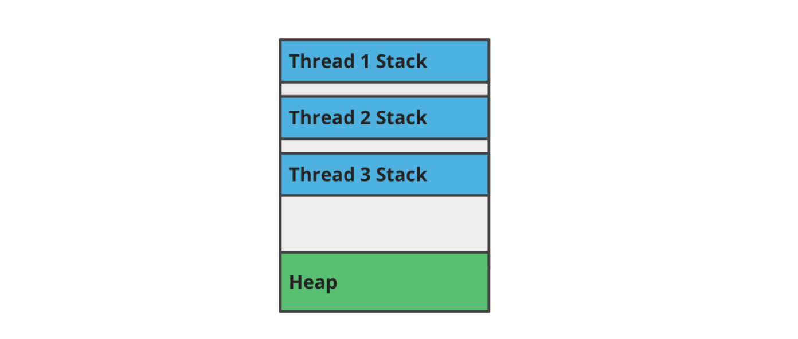

# Concurrent programming

By the end of this lesson you will be able to:

* explain the difference between concurrent, parallel, and sequential programs
* use threads, thread pools, and parallel streams to run Java programs in parallel
* effectively share state in parallel Java programs, using locks, concurrent data structures, and other synchronization techniques.

### Sequential vs Concurrent vs Parallel

The difference between these kinds of programs lies in how and when the program works on tasks. A task in this context is any unit of work, such as processing a user request.

* **Sequential programs** can only work on one task at a time.
* **Concurrent programs** can have multiple tasks in progress at the same time.
* **Parallel programs** can actively be working on multiple tasks at the same time.

### Why Do We Use Concurrency and Parallelism?

* Allows programs to get more work done in the same amount of time.
* Divides a problem into smaller subproblems, and solves each subproblem in parallel.

### Threads

***Threads*** are a way for programs to execute multiple tasks in parallel, at the same time.

You can think of threads as mini programs running within the program. Each thread independently executes its own Java code, which can include variables, for-loops, conditionals, method calls, etc. Anything you can run in a non-parallel Java program, you can also run in parallel, on a thread.

Threads require *hardware* and *operating system* support. In order to write programs that run multiple threads in parallel, the program must be running on a computer with a multi-thread CPU, and the operating system needs to have the required drivers.

### Common Uses of Threads

* Doing multiple tasks, such as handling multiple user requests, at the same time.
* Perform long-running background work, such as downloading a large file. Doing this in a separate thread allows the main thread to continue doing other things while it waits for the background thread to finish.

#### Threads and Program Memory

When a program uses multiple threads, each thread has its own separate call stack:



The call stack is how each thread is able to execute its own code, allocate variables, and call methods independently of the other threads.

However, all threads share the same heap. This means you can have two or more threads accessing shared state, such as an ArrayList or a HashMap.

#### Creating and Running Threads

Java provides the `Thread` class to directly create and run threads:

```java
Thread thread = new Thread(() -> System.out.print("world!"));
System.out.print("Hello, ");
thread.start();
thread.join();
```

This program prints `Hello, world!` to the terminal.

#### Virtual Threads

When you create a Thread object in Java, you're actually creating a virtual thread that's managed by the JVM. Virtual threads make it so that your program could create 10,000 Threads, even if your computer's CPU only supports 4 threads.

Virtual threads can create the illusion of having multiple threads, but your program will still not be able to achieve parallelism unless computer the program is running on supports "real" threads managed by the operating system.

#### Edge Case: Thread Execution Order

Thread Execution Order

You probably noticed in the exercise that when you have a bunch of threads running at the same time, they execute in seemingly random order. That's because threads are run by the operating system's thread scheduler.

There are ways you can try to nudge the scheduler one way or another, but ultimately, your program cannot diectly control it. That's why, if multiple threads are running at the same time, they could run in any order.

#### What is a Race Condition?

A race condition is a kind of software bug that happens when the correctness of a program depends on a particular execution order of parallel threads.

#### Limits of Parallelism

##### Theoretical Limits of Parallelism

Parallelism can enable your programs to do more work in less time, but you can't just keep adding more threads to the program an expect it to keep getting faster.

Your program can only benefit from parallelism to the extent that its tasks are parallelizable.

###### Amdahl's Law

In 1967, a computer scientist named Gene Amdahl came up with an equation to represent this relationship:

S=1/(1-p)

p is the fraction of the program that can be parallelized.
S is how much the program could, in theory, speed up from parallelism.

***Practical Limits of Parallelism***

Threads can also be expensive to create and maintain:

* Each thread needs to have memory allocated for its call stack.
* Since threads require operating system support, Java needs to make system calls to create and register new threads
  with the operating system. System calls are slow!
* Java also internally tracks threads you create. This tracking requires some amount of time and memory.

#### Thread Pools and Executors

A thread pool is a collection of threads that is used to efficiently execute and manage asynchronous work.


Thread pools reduce the cost of using threads by storing them in a worker thread pool. That way, your program can reuse existing threads instead of creating a new thread for each piece of work that needs to be done.

New work is added to a work queue, where it waits for a pooled thread to become available. When a thread is available, it will remove work from the queue, and do the work.

##### Benefits of Thread Pools

Thread pools have several advantages over creating and using Thread objects directly:

* Limits the number of threads used by the program, and prevents the number of threads from growing in an unbounded manner.
* Reuses worker threads, which reduces the time and memory spent creating new threads.

##### Creating Thread Pools

In Java, thread pools are created using the `Executors` API. Here are some examples:

* A thread pool with only one thread:
```java
ExecutorService pool = Executors.newSingleThreadExecutor();
```  
* A thread pool that reuses threads but does not limit the number of threads it can create:
```java
ExecutorService pool = Executors.newCachedThreadPool();
```
* A thread pool that reuses threads and limits the number of threads to 12:
```java
ExecutorService pool = Executors.newFixedThreadPool(12);
```

##### Submitting Asynchronous Work

Thread pools have several methods that let you submit work to be executed asynchronously:

* Submits a `Runnable` with no return value, and returns a `Future`:

```java
Future<?> print = pool.submit(() -> System.out.println("foo"));
```

* Submits a `Runnable` and returns `void`:

```java
pool.execute(() -> System.out.println("foo"));
```

* Submits a `Callable`, whose return value will be accessible via the `Future`:

```java
Future<Path> pathFuture = pool.submit(() -> downloadFile());
```

A future is a reference to the result of an asynchronous computation.

Java uses the `Future` class to represent this concept.

If the asynchronous computation is done, calling the `get()` method will return the result of the computation. If the computation is not done, calling `get()` will cause the program to stop and wait for the computation to finish.

`Futures` are parameterized. Calling the `get()` method of a `Future<Map>` will return a `Map`. Or, if the result is a `List`, calling `get()` on a `Future<List>` will return a `List` result, and so on.

##### Joining Asynchronous Work

You learned that calling `Future.get()` on a future returned from a thread pool will cause the program to stop and wait for the parallel thread to finish its computation. This process of waiting for asynchronous work is called joining. That's why the `Thread` class has a method called `join()`.

What happens if we don't have a `Thread` or `Future` to explicitly join? Here's one solution to the problem:

```java
CountDownLatch latch = new CountDownLatch(1);
pool.execute(() -> {
  System.out.println("foo");
  latch.countDown();
});
latch.await();
```

In this code, `CountDownLatch` helps wait for the asynchronous work to complete even though we don't have a `Thread` or `Future`.

#### ForkJoin Pools

`ForkJoinPool` is a specialized kind of thread pool that has the following advantages over traditional thread pools:

* It uses a technique called work stealing so that idle ***worker threads*** can find work to do.
* Its API is optimized for asynchronous work that ***creates more work***. You might also hear this called recursive work.

In practice, work stealing does not have a huge impact on performance because "traditional" thread pools do a fine job of distributing work across the worker threads. However, depending on the kind of asynchronous tasks your program creates, work stealing may give an extra efficiency boost.

#### ForkJoinTasks

When you create work to submit to a `ForkJoinPool`, you usually do so by subclassing either `RecursiveTask` or `RecursiveAction`.

Use `RecursiveTask` for asynchronous work that returns a value, and use `RecursiveAction` when the asynchronous computation does not return a value.


The `ForkJoinPool` API is optimized for recursive work, which is work that creates other work.

When you are implementing the `compute()` method of a `RecursiveAction` or `RecursiveTask`, you can submit more work to the thread pool by calling the `invoke()` method, or one of its many variants. Once you invoke the recursive work, your `RecursiveAction` or `RecursiveTask` can wait for the results and use them in its own computation, or it can proceed without joining the results.

You can also use the "normal" thread pool methods of `submit()` and `execute()`.


#### `ForkJoinPool` Demo

In this demo, we took a recursive, sequential algorithm, and parallelized the work using a `ForkJoinPool`.

***Code from the Demo***

`CountWordsTask.java`

```java
import java.io.IOException;
import java.nio.file.Files;
import java.nio.file.Path;
import java.util.List;
import java.util.concurrent.RecursiveTask;
import java.util.stream.Collectors;
import java.util.stream.Stream;

public final class CountWordsTask extends RecursiveTask<Long> {
  private final Path path;
  private final String word;

  public CountWordsTask(Path path, String word) {
    this.path = path;
    this.word = word;
  }

  @Override
  protected Long compute() {
    if (!Files.isDirectory(path)) {
      return WordCounter.countWordInFile(path, word);
    }
    Stream<Path> subpaths;
    try {
      subpaths = Files.list(path);
    } catch (IOException e) {
      return 0L;
    }
    List<CountWordsTask> subtasks =
        subpaths.map(path -> new CountWordsTask(path, word))
        .collect(Collectors.toList());
    invokeAll(subtasks);
    return subtasks
        .stream()
        .mapToLong(CountWordsTask::getRawResult)
        .sum();
  }
}
```

`WordCounter.java`

```java
import java.io.IOException;
import java.nio.charset.StandardCharsets;
import java.nio.file.Files;
import java.nio.file.Path;
import java.time.Duration;
import java.time.Instant;
import java.util.Arrays;
import java.util.concurrent.ForkJoinPool;

public final class WordCounter {
  public static void main(String[] args) {
    if (args.length != 2) {
      System.out.println("Usage: WordCounter [path] [word]");
      return;
    }
    Path start = Path.of(args[0]);
    String word = args[1];

    Instant before = Instant.now();

    ForkJoinPool pool = new ForkJoinPool();
    long count = pool.invoke(new CountWordsTask(start, word));

    Duration elapsed = Duration.between(before, Instant.now());
    System.out.println(count + " (" + elapsed.toSeconds() + " seconds)");
  }

  public static long countWordInFile(Path file, String word) {
    try {
      return Files.readAllLines(file, StandardCharsets.UTF_8)
          .stream()
          .flatMap(l -> Arrays.stream(l.split(" ")))
          .filter(word::equalsIgnoreCase)
          .count();
    } catch (IOException e) {
      return 0;
    }
  }

  private static long countWords(Path path, String word) {
    if (!Files.isDirectory(path)) {
      return countWordInFile(path, word);
    }
    try {
      return Files.list(path)
          .mapToLong(p -> countWords(p, word))
          .sum();
    } catch (IOException e) {
      return 0;
    }
  }
}
```

#### Parallel Streams

***Parallel streams*** are a way to execute stream pipelines in parallel, on multiple threads.

They can often be a quick way to add parallelism to existing, sequential stream pipeline.

##### Using Parallel Streams

You use parallel streams by calling the `parallelStream()` on a Java collection, or by calling the `parallel()` method on an existing `Stream`. Here's a non-parallel `Stream` example from the lesson on Functional Programming:

```java
Map<Year, Long> graduatingClassSizes = studentList
    .stream()
    .collect(Collectors.groupingBy(
        Student::getGraduationYear, Collectors.counting());
```

Here is a parallel version of the same `Stream`:

```java
Map<Year, Long> graduatingClassSizes = studentList
    .parallelStream()
    .collect(Collectors.groupingByConcurrent(
        Student::getGraduationYear, Collectors.counting());
```

Notice also how a concurrent `Collector` needs to be used. Not all collectors support concurrency; if you accidentally apply such a collector to a parallel stream, the stream will not actually run in parallel.

#### Using Parallel Streams with Thread Pools

By default, parallel streams run threads in the default `ForkJoinPool.commonPool()`. You can circumvent that default by wrapping the stream computation in a `Callable` and submitting it to a `ForkJoinPool` explicitly:

```java
ForkJoinPool pool = new ForkJoinPool();
Future<Map<Year, Long>> graduatingClassSizes = pool.submit(() ->
    studentList.parallelStream()
    .collect(Collectors.groupingByConcurrent(
        Student::getGraduationYear, Collectors.counting()));
```

This can come in handy if you want finer control over the parallelism, or if you want to separate your parallel stream conputations into different thread pools.

### Synchronization

As you saw in a previous section, it's possible for multiple threads to access shared state, such as a `List` or `Map` stored in the heap. It's also possible multiple threads could be accessing a shared resource, such as a file.

In the context of multi-threaded programming, `synchronization` is the process of limiting the number of threads that can access a shared resource at the same time.

Synchronization is actually a more general concept that covers more than just threads. For example you can limit concurrent access of multiple processes, or programs, to a file. In this lesson we will only be talking about threads.

#### When is Synchronization Needed?

You should think about synchronization whenever you have multiple threads accessing the same shared resource, such as a data structure or a file.


If all the threads are just reading the shared resource, that's usually okay without synchronization. This is sometimes called read-only access to the shared resource.

On the other hand, if one or both of the threads is updating, or writing to, the shared resource, synchronization may be required!

#### Ways to Synchronize

Java has several built-in utilities to help you synchronize multi-threaded code. Here are two examples:

* Synchronized collection wrappers:
  
```java
Map<String, Integer> votes = Collections.synchronizedMap(new HashMap<>());
```

* Data structures and tools in the java.util.concurrent package that are specifically designed for concurrent access:

```java
Map<String, Integer> votes = new ConcurrentHashMap<>();
```

#### Synchronization Demo: Voting App

##### Single-Threaded Version

```java
import java.util.*;
import java.util.concurrent.*;

public final class VotingApp {
  public static void main(String[] args) throws Exception {

    ExecutorService executor = Executors.newSingleThreadExecutor();

    Map<String, Integer> votes = new HashMap<>();

    List<Future<?>> futures = new ArrayList<>(10_000);
    for (int i = 0; i < 10_000; i++) {
      futures.add(
          executor.submit(() -> {
            votes.compute("Larry", (k, v) -> (v == null) ? 1 : v + 1);
          }));
    }
    for (Future<?> future : futures) {
      future.get();
    }
    executor.shutdown();

    System.out.println(votes);
  }
}
```

##### Multi-Threaded Version Using `ConcurrentHashMap`

```java
import java.util.*;
import java.util.concurrent.*;

public final class VotingApp {
  public static void main(String[] args) throws Exception {

    ExecutorService executor = Executors.newFixedThreadPool(12);

    Map<String, Integer> votes = new ConcurrentHashMap<>();

    List<Future<?>> futures = new ArrayList<>(10_000);
    for (int i = 0; i < 10_000; i++) {
      futures.add(
          executor.submit(() -> {
            votes.compute("Larry", (k, v) -> (v == null) ? 1 : v + 1);
          }));
    }
    for (Future<?> future : futures) {
      future.get();
    }
    executor.shutdown();

    System.out.println(votes);
  }
}
```

##### Multi-Threaded Version Using `Collections.synchronizedMap()`

```java
import java.util.*;
import java.util.concurrent.*;

public final class VotingApp {
  public static void main(String[] args) throws Exception {

    ExecutorService executor = Executors.newFixedThreadPool(12);

    Map<String, Integer> votes = Collections.synchronizedMap(new HashMap<>());

    List<Future<?>> futures = new ArrayList<>(10_000);
    for (int i = 0; i < 10_000; i++) {
      futures.add(
          executor.submit(() -> {
            votes.compute("Larry", (k, v) -> (v == null) ? 1 : v + 1);
          }));
    }
    for (Future<?> future : futures) {
      future.get();
    }
    executor.shutdown();

    System.out.println(votes);
  }
}
```

#### What are Atomic Operations?

An atomic operation is an operation that is executed as a single step, and cannot be split into smaller steps.

Atomicity is a really important concept in concurrent programming. If an operation is atomic, that means we don't have to worry about synchronizing it across different threads.

In the demo, you saw how `ConcurrentHashMap.compute()` is an atomic operation, but individually calling `ConcurrentHashMap.get()` and `ConcurrentHashMap.put()` is not atomic.

### Immutable Objects

An immutable object is an object whose value cannot change after it is created.

The term "immutable" has the same base as the word "mutate". If an object is IM-mutable, that means it cannot be mutated.

#### Mutable Objects

* Unsafe to use as hash keys.
* If used from multiple threads, must be explicitly synchronized.
* Harder to reason about in code.

#### Immutable Objects

* Can be safely used as keys in hash-based data structures, like HashMap.
* Inherently thread-safe.
* Easier to reason about in code.

### The `synchronized` Keyword

#### How to Use the `synchronized` Keyword

The best way to synchronize is to use high-level built-in tools like the synchronized `Collections` wrappers, or data structures in the `java.util.concurrent` package.

When those options aren't available, you can use the `synchronized` keyword for low-level synchronization control.

Here's an example using the voting app code from the previous section:

```java
public final class VotingApp {
  private final Map<String, Integer> votes = new HashMap<>();

  public void castVote(String performer) {
    synchronized (this) {
      Integer count = votes.get(performer);
      if (count == null) {
        votes.put(performer, 1);
      } else {
        votes.put(performer, count + 1);
      }
    }
  }
}
```

The thing in parentheses after the `synchronized` keyword is the lock object. When a thread enters the code block, it takes ownership of the lock. Only one thread at a time can own the lock at a time, so only one thread is allowed to be executing code inside the `synchronized` block at a given time.

#### Lock Objects

Any object can be used as the lock. For example, you could use the votes map as the lock object:

```java
public void castVote(String performer) {
    synchronized (votes) {
      ...
    }
  }
}
```

Or, you could create a completely new object just to serve the purpose of the lock:

```java
private final Object lock = "SpecialLock";
public void castVote(String performer) {
    synchronized (lock) {
      ...
    }
  }
}
```

If you decide to use the `this` keyword, the lock object is the current instance of the class. If you're using `this` to lock the entire method, you can use this trick instead:

```java
public final class VotingApp {
  private final Map<String, Integer> votes = new HashMap<>();

  public synchronized void castVote(String performer) {
    Integer count = votes.get(performer);
    if (count == null) {
      votes.put(performer, 1);
    } else {
      votes.put(performer, count + 1);
    }
  }
}
```

This code does the same thing, but is a little nicer to look at.

#### Demo: Thread-Safe Singleton Pattern

In this demo, we'll take a look at how to make the singleton design pattern thread-safe.

##### Code from the Demo

```java
import java.util.Objects;

public final class Database {
    private static Database database;

    private Database() {}

    public static Database getInstance() {
        if (database == null) {
            synchronized (Database.class) {
                if (database == null) {
                    database = new Database();
                    database.connect("/usr/local/data/users.db");
                }
            }
        }
        return database;
    }

    // Connects to the remote database.
    private void connect(String url) {
        Objects.requireNonNull(url);
    }

    public static void main(String[] args) {
        Database a = Database.getInstance();
        Database b = Database.getInstance();

        System.out.println(a == b);
    }
}
```

### Advanced Synchronization

In this section, you'll learn about some synchronization tools that may come in handy when the `synchronized` keyword does not fit your use case.

#### When to Use the `ReentrantLock` Class

The `synchronized` keyword only works with blocks of code — either explicit curly braces after the lock object, or an entire method.

Sometimes, you may want to take ownership of the lock in one method, and release ownership of the lock in another method. Doing this is impossible using only the `synchronized` keyword.

For these kinds of situations, Java provides the `ReentrantLock` class.  
Here's a code example using `ReentrantLock`:

```java
public final class VotingApp {
  private final Map<String, Integer> votes = new HashMap<>();|
  private final Lock lock = new ReentrantLock();
  public void castVote(String performer) {
    lock.lock();
    try {
      votes.compute(
        performer, (k, v) -> (v == null) ? 1 : v + 1);
    } finally {
      lock.unlock();
    }
  }
}
```

The key feature here is that the `lock()` and `unlock()` methods can be called anywhere, by any thread that has a reference to the `lock` object.

You could for example, have a data structure like a `HashMap` that stores `ReentrantLocks` as values. Maybe the keys are file names, or some other resource that is shared between threads.

#### What is a Deadlock?

A deadlock is a kind of concurrent programming error that happens when all threads are stuck waiting for some action. But that action never happens, meaning no threads are ever able to make progress.

One common source of deadlocks is when a thread takes ownership of a lock, but never releases it. This can happen when two threads need the same locks, but take ownership of them in a different order.

#### Other Kinds of Locks

`ReentrantLock` is just one kind of lock object.

If you have a moment, take a look in the `java.util.concurrent.locks` package, which contains other kinds of specialized locks.

It contains other kinds of specialty locks, such as `ReadWriteLock`. This can be useful when you have some threads that only need to read a shared resource, but other threads need to modify the resource.

#### Semamphores

The `synchronized` keyword only allows one thread at a time within a guarded block of code. What do you do if you need to allow more than one thread?

The `Semaphore` class can help with this scenario.

To create a `Semaphore` you tell it how many permits it can give out:

```java
Semaphore semaphore = new Semaphore(4);
```

Usually the number passed to the `Semaphore` constructor is the number of threads you want to allow in the guarded code, but you could also have a thread taking multiple permits if you want.

Here's how threads obtain and release permits from the semaphore:

```java
try {
  semaphore.acquire();
  // Up to 4 threads can be executing here in parallel!
  // ...
} finally {
  // Give another thread a turn.
  semaphore.release();
}
```

You might have noticed that if you create a `Semaphore` with only 1 permit to give out, it behaves the same as a `ReentrantLock`.

When a lock only allows one thread, you will sometimes here it called a mutex, which is a portmanteau of the term "mutual exclusion".