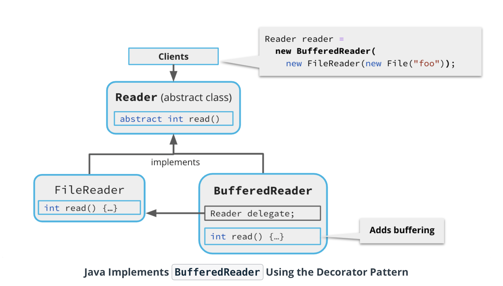

# Design pattern

### Introduction

By the end of this lesson, you will be able to recognize common categories of software design problems, and apply well established design patterns to help solve those problems.

You will understand the purpose of the following patterns, and you'll be able to use them to architect your Java programs:

* Singleton
* Builder
* Abstract factory
* Strategy
* Template method
* Adapter
* Decorator
* Proxy
* Dependency injection

### Big Picture and Intuition

***SOLID: Principles of Good Software Design***

What are the characteristics of good software design? Software engineers have been philosophising about this question since the early days of software development.

***SOLID*** is one of the prevaliing frameworks for thinking about this question. This mnemonic was coined by the American software engineer Robert C. Martin in 2000.

* Single Responsibility Principle
* Open-Closed Principle
* Liskov Substitution Principle
* Interface Segregation Principle
* Dependency Inversion Principle

### Creational Patterns

A creational design pattern is any design pattern that concerns how objects in your program are created.
These patterns can help you manage the creation of objects as your code becomes increasingly complex.

#### Singleton Pattern

You may want to use a singleton if:

* A class that has only one instance, but no clear owner.
* You want that instance to be available everywhere in your code.
* The instance is initialized only when it's first used (also known as lazy initialization).

#### Singleton Example

`Demo Code`

```java
import java.util.Objects;

public final class Database {
    private static Database database;

    private Database() {}

    public static Database getInstance() {
        if (database == null) {
            database = new Database();
            database.connect("/usr/local/data/users.db");
        }
        return database;
    }

    // Connects to the remote database.
    private void connect(String url) {
        Objects.requireNonNull(url);
    }

    public static void main(String[] args) {
        Database a = Database.getInstance();
        Database b = Database.getInstance();

        System.out.println(a == b);
    }
}
```

By the way, you probably noticed that this Database class doesn't actually connect to a remote database. The purpose of the code is to demonstrate the singleton design pattern as simply as possible.

### Edge Case: Singleton Anti-pattern

#### Disadvantages of Singletons

If you *misuse* the singleton pattern, it can be detrimental to your software design.

* Singletons can cause **brittle** assumptions in your code. If later on, you decide you need **multiple instances**  of the class, you might have to refactor a bunch of code.
* Code that depends on singletons can become **hard to test**.

If you're itching for a code example of how the singleton pattern can result in difficult-to-test code, and how Dependency Injection can improve testability, you can look forward to the Dependency Injection exercise near the end of this lesson!

### Abstract Factory

A factory is anything that creates objects. Factories are useful for hiding construction details from callers.

* If the thing creating objects is a method, it's known as a factory method. You've already seen some examples of factory methods, such as Stream.of().
* If the thing creating objects is also an object, it's known as an abstract factory. These are useful when you want to separate construction of objects into a completely separate Java interface.

When to Use Abstract Factories

* You want to hide construction details from callers.
* You want to encapsulate construction of several related objects into a single Java interface.

#### Abstract Factory Demo

Code from Demo

`PageParserFactory.java` (interface)

```java
package com.udacity.webcrawler.parser;

/**
 * A factory interface that supplies instances of {@link PageParser} that have common parameters
 * (such as the timeout and ignored words) preset from injected values.
 */
public interface PageParserFactory {

  /**
   * Returns a {@link PageParser} that parses the given {@link url}.
   */
  PageParser get(String url);
}
```

`PageParserFactoryImpl.java`

```java
package com.udacity.webcrawler.parser;

import com.udacity.webcrawler.Timeout;
import com.udacity.webcrawler.profiler.Profiler;

import javax.inject.Inject;
import java.time.Duration;
import java.util.List;
import java.util.regex.Pattern;

/**
 * A {@link PageParserFactory} that wraps its returned instances using a {@link Profiler}.
 */
final class PageParserFactoryImpl implements PageParserFactory {
  private final Profiler profiler;
  private final List<Pattern> ignoredWords;
  private final Duration timeout;

  @Inject
  PageParserFactoryImpl(
      Profiler profiler, @IgnoredWords List<Pattern> ignoredWords, @Timeout Duration timeout) {
    this.profiler = profiler;
    this.ignoredWords = ignoredWords;
    this.timeout = timeout;
  }

  @Override
  public PageParser get(String url) {
    // Here, parse the page with the initial timeout (instead of just the time remaining), to make
    // the download less likely to fail. Deadline enforcement should happen at a higher level.
    PageParser delegate = new PageParserImpl(url, timeout, ignoredWords);
    return profiler.wrap(PageParser.class, delegate);
  }
}

```

### Builder

#### What is a Builder?

* A mutable factory that constructs the state of a to-be-created object, property by property, and then builds the object.
* Usually supports method chaining.
* Often used to create immutable data objects.

#### Building a Builder

Remember that "bean" class, `UdacisearchClient`, 
you worked with in previous exercises? That class has a constructor with lots of parameters. Furthermore, it's a mutable class. It's the perfect candidate for the Builder Pattern.

This should be a fairly straightforward procedure — you are going to take the `UdacisearchClient`
class and make a `Builder` class for it. This will provide the following benefits:

* `UdacisearchClient` will become an immuable type, which means its value does not change after it is created.
* The builder class will emulate named parameters. Unlike the large constructor, the builder makes it harder for callers to accidentally mix up the order of the client properties.

Here's how to apply the builder pattern:

* First, make the `UdacisearchClient` constructor `private` instead of `public`.
* Next, make all the instance fields `final` and remove all the setter methods, 
  such as `UdacisearchClient#setId(int)`. Congratulations, `UdacisearchClient` 
  is now an immutable type — but it's no good if we can't instantiate it! 
  Don't forget to delete the default values of the fields.
* Give `UdacisearchClient` a static inner class called `Builder`. 
  Give the builder class a non-final instance field corresponding 
  to each field of `UdacisearchClient`.
* Create setter methods for all the builder's fields. Each method should return a reference to the Builder itself (i.e., this).
* Finally, add a `UdacisearchClient.Builder#build()` method that calls the now-private `UdacisearchClient` constructor.
* Try out `UdacisearchClient`.Builder in `Main.java` by constructing the `client` variable with the new `Builder` class:
  `javac Main.java java Main`

#### Solution: Builder

`Solution: Builder`

```java
import java.time.Duration;
import java.time.Instant;
import java.time.ZoneId;

public final class UdacisearchClient {
  private final String name;
  private final long id;
  private final int quarterlyBudget;
  private final int numEmployees;
  private final Instant contractStart;
  private final Duration contractLength;
  private final ZoneId timeZone;
  private final String billingAddress;

  private UdacisearchClient(
      String name,
      long id,
      int quarterlyBudget,
      int numEmployees,
      Instant contractStart,
      Duration contractLength,
      ZoneId timeZone,
      String billingAddress) {
    this.name = name;
    this.id = id;
    this.quarterlyBudget = quarterlyBudget;
    this.numEmployees = numEmployees;
    this.contractStart = contractStart;
    this.contractLength = contractLength;
    this.timeZone = timeZone;
    this.billingAddress = billingAddress;
  }

  public String getName() {
    return name;
  }

  public long getId() {
    return id;
  }

  public int getQuarterlyBudget() {
    return quarterlyBudget;
  }

  public int getNumEmployees() {
    return numEmployees;
  }

  public Instant getContractStart() {
    return contractStart;
  }

  public Duration getContractLength() {
    return contractLength;
  }

  public ZoneId getTimeZone() {
    return timeZone;
  }

  public String getBillingAddress() {
    return billingAddress;
  }

  @Override
  public String toString() {
    return "UdacisearchClient{" +
        "name='" + getName() + '\'' +
        ", id=" + getId() +
        ", quarterlyBudget=" + getQuarterlyBudget() +
        ", numEmployees=" + getNumEmployees() +
        ", contractStart=" + getContractStart() +
        ", contractLength=" + getContractLength() +
        ", timeZone=" + getTimeZone() +
        ", billingAddress='" + getBillingAddress() + '\'' +
        '}';
  }

  @Override
  public boolean equals(Object o) {
    if (this == o) return true;
    if (!(o instanceof UdacisearchClient)) return false;
    UdacisearchClient that = (UdacisearchClient) o;
    return id == that.id &&
        quarterlyBudget == that.quarterlyBudget &&
        numEmployees == that.numEmployees &&
        name.equals(that.name) &&
        contractStart.equals(that.contractStart) &&
        contractLength.equals(that.contractLength) &&
        timeZone.equals(that.timeZone) &&
        billingAddress.equals(that.billingAddress);
  }

  @Override
  public int hashCode() {
    return Objects.hash(
        name,
        id,
        quarterlyBudget,
        numEmployees,
        contractStart,
        contractLength,
        timeZone,
        billingAddress);
  }

  public static final class Builder {
    private String name = "";
    private long id = 0;
    private int quarterlyBudget = 0;
    private int numEmployees = 0;
    private Instant contractStart = Instant.EPOCH;
    private Duration contractLength = Duration.ZERO;
    private ZoneId timeZone = ZoneId.of("Etc/UTC");
    private String billingAddress = "";

    public Builder setName(String name) {
      this.name = name;
      return this;
    }

    public Builder setId(long id) {
      this.id = id;
      return this;
    }

    public Builder setQuarterlyBudget(int quarterlyBudget) {
      this.quarterlyBudget = quarterlyBudget;
      return this;
    }

    public Builder setNumEmployees(int numEmployees) {
      this.numEmployees = numEmployees;
      return this;
    }

    public Builder setContractStart(Instant contractStart) {
      this.contractStart = contractStart;
      return this;
    }

    public Builder setContractLength(Duration contractLength) {
      this.contractLength = contractLength;
      return this;
    }

    public Builder setTimeZone(ZoneId timeZone) {
      this.timeZone = timeZone;
      return this;
    }

    public Builder setBillingAddress(String billingAddress) {
      this.billingAddress = billingAddress;
      return this;
    }

    public UdacisearchClient build() {
      return new UdacisearchClient(
          name,
          id,
          quarterlyBudget,
          numEmployees,
          contractStart,
          contractLength,
          timeZone,
          billingAddress);
    }
  }
}
```

`Main.java`

```java
import java.time.Duration;
import java.time.Instant;
import java.time.ZoneId;

public final class Main {

  public static void main(String[] args) {
    UdacisearchClient client =
        new UdacisearchClient.Builder()
            .setName("CatFacts LLC")
            .setId(17)
            .setQuarterlyBudget(8000)
            .setNumEmployees(5)
            .setContractStart(Instant.now())
            .setContractLength(Duration.ofDays(180))
            .setTimeZone(ZoneId.of("America/Los_Angeles"))
            .setBillingAddress("555 Meowmers Ln, Riverside, CA 92501")
            .build();

    System.out.println(client);
  }
}
```

### Behavioral Patterns

A behavioral design pattern is a pattern that involves how different objects interact. This is a very broad category. This lesson covers the following patterns:

* The Strategy pattern
* The Template Method pattern

### Strategy

What is the Strategy Pattern?

* You define an interface to represent a kind of task or problem.
* Each concrete implementation defines a different "strategy" for solving the task.
* The strategies can be swapped for each other because callers code against the interface.

### Template Method

What is the Template Method Pattern?
* You define a base class or interface for a procedure or algorithm, but leave empty placeholders for some parts of the procedure.
* Each placeholder is a blank or default method in the base class.
* This base class acts as a template.
* Callers fill in the blanks by extending the base class and overriding the placeholder methods.

### Structural Patterns

A structural design pattern is a design pattern that involve how objects fit together to form the structure of the software.

### Adapter Pattern

You can use an adapter whenever you need to transform one API or interface into another. Adapters allow classes with otherwise incompatible interfaces to work together!

Adapters typically "wrap" an existing interface to adapt it to a different interface. One common use of the adapter pattern is to wrap legacy APIs, but adapters can be used with all sorts of APIs.

### Decorator Pattern



#### Code from the Demo

```java
import java.io.BufferedReader;
import java.io.File;
import java.io.FileReader;
import java.io.IOException;
import java.io.Reader;
import java.util.Objects;

public final class CountReads {

    public static final class CountingReader extends Reader {
        private int count = 0;

        private final Reader delegate;

        CountingReader(Reader delegate) {
            this.delegate = Objects.requireNonNull(delegate);
        }

        public int getCount() {
            return count;
        }

        @Override
        public int read(char[] cbuf, int off, int len) throws IOException {
            count++;
            return delegate.read(cbuf, off, len);
        }

        @Override
        public void close() throws IOException {
            delegate.close();

        }
    }

    public static void main(String[] args) throws Exception {
        try (FileReader reader = new FileReader(new File("randomtext.txt"))) {
            CountingReader unbufferedReads = new CountingReader(reader);
            CountingReader bufferedReads = new CountingReader(new BufferedReader(unbufferedReads));

            char[] data = new char[100];
            while (bufferedReads.read(data) != -1);

            System.out.println("Calls to BufferedReader.read(): " + bufferedReads.getCount());
            System.out.println("Calls to FileReader.read(): " + unbufferedReads.getCount());
        }
    }
}
```

In this demo, we wrote a decorator that counted the number of reads to a Reader. The decorator proved that the BufferedReader reduced the number of reads from disk by about 90%. Pretty good!

***Adapter vs Decorator***

* These patterns both "wrap" another object, called the **delegate**.
* An **Adapter** returns a **different interface** than the delegate.
* A **Decorator** returns the **same interface**, but with **added functionality** or responsibilities.
* A **Proxy** is similar to a Decorator, but the proxy usually **controls or manages** access to the delegate.

### Dependency Injection

#### What is a Dependency?

A dependency is anything your code needs to work, such as an external library, an environment variable, a remote website, or a database.

In the context of dependency injection, a dependency usually refers to an object, class, or interface that your code imports, creates, or uses.

#### What is Dependency Injection?

Dependency Injection, or DI, is a design pattern that moves the creation of dependencies to outside of your code. Instead of creating objects, you tell the DI framework to create the objects for you, and then you inject those objects into your class.

#### Using `@Inject` Annotations

To inject objects from a DI framework, you can add `@Inject` annotations to your code. You can add them directly to instance fields:

```java
class CourseRegistrar {
  @Inject private Database db;
  @Inject private Clock clock;
  @Inject private RegistrationFactory factory;

  boolean registerStudentForCourse(Student s, int courseId) {
    Course c = db.getCourse(courseId);
    if (clock.instant().isAfter(c.getRegistrationDeadline())) return false;
    if (!s.getPassedCourses().containsAll(c.getPrereqs())) return false;
    db.createRegistration(factory.create(courseId, s.getId()));
    return true;
  }
}
```

... or, you can add `@Inject` annotations to constructors:

```java
class CourseRegistrar {
  private final Database db;
  private final Clock clock;
  private final RegistrationFactory factory;

  @Inject
  CourseRegistrar(Database db, Clock clock, RegistrationFactory factory) {
    this.db = db;
    this.clock = clock;
    this.factory = factory;
  }

  boolean registerStudentForCourse(Student s, int courseId) {
    Course c = db.getCourse(courseId);
    if (clock.instant().isAfter(c.getRegistrationDeadline())) return false;
    if (!s.getPassedCourses().containsAll(c.getPrereqs())) return false;
    db.createRegistration(factory.create(courseId, s.getId()));
    return true;
  }
}
```

It's up to you do decide where to place `@Inject` annotations in your code.
Annotating fields directly can save some lines of code, while annotating constructors allows you to mark the fields `final`.

#### How DI Injects Objects

The DI framework will attempt to instantiate any object that's injected. The DI framework will fail at runtime if it doesn't know how to create the injected object. DI frameworks use modules to configure which classes or objects should be used when an interface is injected.

##### Indirect Dependencies

DI also takes care of indirect, or transitive, dependencies. If you @Inject a class, and that class also has a constructor marked with @Inject, the DI framework will try to inject all the constructor dependencies, and all those dependencies' dependencies, and so on.

##### Using DI to Create Singletons

DI frameworks can usually be configured to return a specific instance of an object whenever it's injected. Any time that object is requested by an @Inject annotation, the DI framework will supply the exact same instance, making it effectively a singleton.

#### Edge Case: Dependency Injection Disadvantages

* Requires extra configuration (annotations or XML).
* Can make code harder to understand and debug.