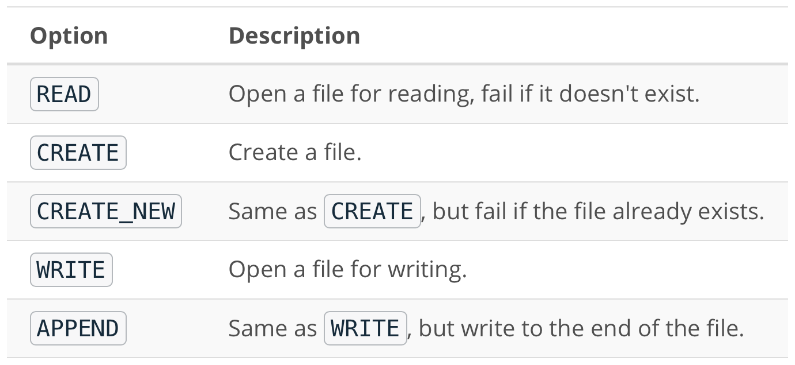
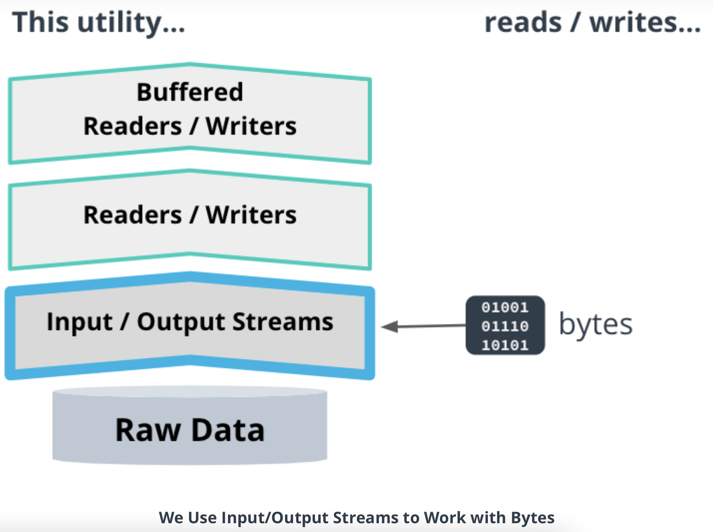
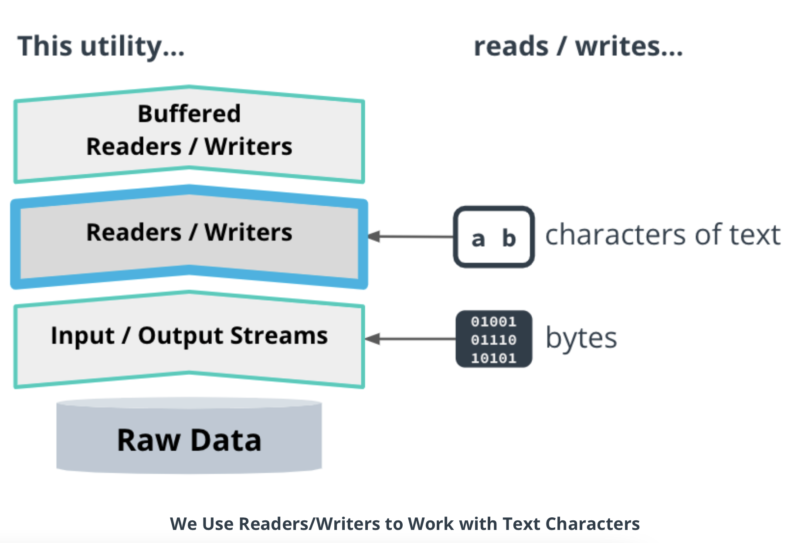
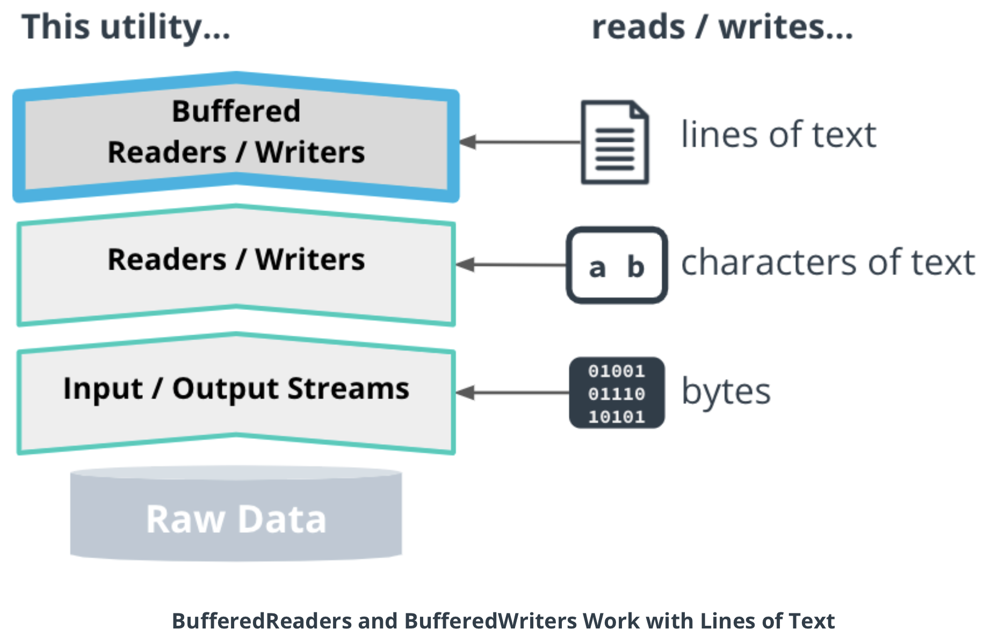
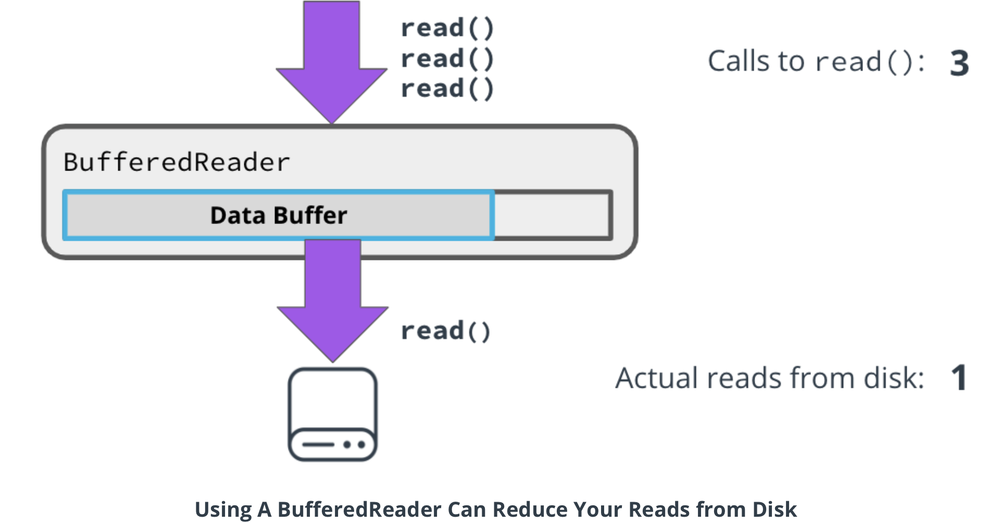
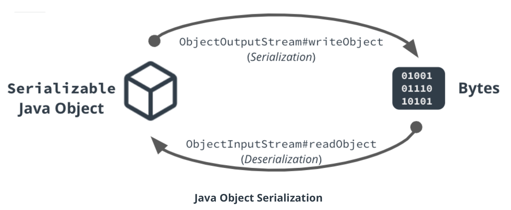

## Introduction to Files & I/O

By the end of this lesson, you should be able to:

* Read and write binary and text files in Java.
* Prevent resource leaks using the try-with-resources idiom.
* Compare several different serialization formats: JSON, XML, and Java Object Serialization.
* Serialize and deserialize JSON in Java.

### Big Picture and Developing Your Intuition about Files & I/O

#### I/O (Input/Output)

**I/O** stands for "Input" / "Output". All useful programs have some kind of input and output.

**Input** is data the program receives from external processes and systems, such as from the local file system or the Internet.

**Output** is data the program sends to external processes and systems.

#### Program Memory vs. Persistent Storage

##### Program Memory

In Java programs and other computer programs, short-term storage happens in the program memory.

* Variables, objects and data structures are stored in the heap and stack. 
* Memory access is fast.
* Memory is erased when the program is done running.

##### Persistent Storage

If we want to store data for longer periods of time, we have to use long-term storage, also known as persistent storage.

* Files, stored on disk, are one of the most common forms of persistent storage. Your PC, laptop, and phone all have their own file systems that can store different kinds of files.
* Files stick around, or persist, after the program is done executing, so can also be read by humans or other programs.
* Persistent storage access is usually much slower than memory access.
* Databases are another common form of persistent storage.

### Files & Path APIs

#### Files API

The Files API is Java's Swiss Army knife for file operations. It contains static methods for doing all sorts of file operations.

#### File Open Options

When you create, read, or write a file, there are standard modes that you can 
use to do so. Java uses the `StandardOpenOptions` class to encapsulate 
all these modes.

Here are some of the common modes:



#### Path API

A `Path` is Java's way to refer to a file on a file system:

```java
Path p = Path.of("your/path/here");
```

All paths either refer to *files* or *directories*.

* A *file* contains stored data or bytes.
* A *directory* contains zero or more files.

All paths are either *absolute* or *relative*.

* *Absolute paths* start with a forward-slash (/) (known as the *root directory* on Mac and Linux), or a drive name on Windows.
* *Relative paths* are only meaningful relative to some other starting point. They do not start with a forward slash or drive name.

Note that the Path object in Java always uses forward-slashes to delimit the parts of the path String, even if the underlying file system uses backslashes (such as the NTFS file system on Windows).

### Input and Output Streams

#### Reading and Writing Data in Java

In Java, the utilities for reading and writing data are built on top of each other. This diagram shows you what that means.
When you use a `BufferedReader` to read lines of text,
that buffered reader is reading from another underlying
`Reader` that provides characters of text. That `Reader`,
in turn, is itself using an `InputStream` behind the scenes to read the raw data.



Input and output streams are the lowest level utilities Java provides. They give you access to the raw data, in the form of bytes. This data can come from a file, from user input on the command-line, or from a network or other source. These are the lowest level APIs Java offers for reading or writing a stream of bytes.

We use them to:

* access low-level bytes of data from input
* write bytes to output

#### `InputStream` Example

```java
InputStream in =
   Files.newInputStream(Path.of("test"), StandardOpenOption.READ);
byte[] data = new byte[10];
while (in.read(data) != -1) {  // Returns the number of bytes read
  useData(data);
}
in.close();  // Close the "test" file
```

This code creates a file called "test" using `newInputStream()` method of the Files API. The code calls the `read()` method, which reads the data into a `byte[]` and returns the number of bytes that were read. If no bytes were read, it returns `-1`. This code will read the entire file, 10 bytes at a time, until the loop reaches the end of the file.

#### `OutputStream` Example

```java
OutputStream out = Files.newOutputStream(Path.of("test"));
out.write("Hello, world!".getBytes());
out.close();  // Close the "test" file
```

The basic `write()` method only deals with bytes. It's pretty self-explanatory: you give the `write()` method a `byte[]`
, and it writes those bytes to the output stream.

Both code examples call the `close()` method, which we'll cover in more detail later in this lesson.

#### Input & Output Streams Code Demo

##### Demo Code: Ways to Copy a File

##### Reading and Writing the Data Directly

```java
import java.io.IOException;
import java.io.InputStream;
import java.io.OutputStream;
import java.nio.file.Files;
import java.nio.file.Path;

public class CopyFile {
    public static void main(String[] args) throws IOException {

        InputStream in = Files.newInputStream(Path.of(args[0]));;
        OutputStream out = Files.newOutputStream(Path.of(args[1]));;

        byte[] data = new byte[10];
        while (in.read(data) != -1) {
            out.write(data);
        }
        in.close();
        out.close();
    }
}
```

##### Using `InputStream.transferTo(OutputStream)`

```java
import java.io.IOException;
import java.io.InputStream;
import java.io.OutputStream;
import java.nio.file.Files;
import java.nio.file.Path;

public class InputOutputStreams {
    public static void main(String[] args) throws IOException {

        InputStream in = Files.newInputStream(Path.of(args[0]));;
        OutputStream out = Files.newOutputStream(Path.of(args[1]));;
        in.transferTo(out);
        in.close();
        out.close();
    }
}

```

##### Using the Files API

```java
import java.io.IOException;
import java.nio.file.Path;

public final class CopyFile {
    public static void main(String[] args) throws IOException {
        Files.copy(Path.of(args[0]), Path.of(args[1]));
    }
}
```

### Readers and Writers

#### Readers / Writers

Readers and Writers are the next level of abstraction built on top of input and output streams. These interfaces read and write text characters.



##### Reader Example

```java
char[] data = new char[10];
Reader reader =
   Files.newBufferedReader(Path.of("test"), StandardCharsets.UTF_8);
while (reader.read(data) != -1) {
 useData(data);
}
reader.close();
```

Just like input streams, `Readers` are usually created with the Files API. 
But instead of reading `bytes`, we are reading `chars`. 
There's also a `StandardCharset`, 
which we'll cover that in more detail in the next video.

##### Writer Example

```java
Writer writer =
   Files.newBufferedWriter(Path.of("test"),
                           StandardCharsets.UTF_8);
writer.write("hello, world");
writer.close();  // Close the "test" file
```

The `Writer` is pretty much what you would expect. 
This time we are writing encoded `Strings` of data instead of raw `bytes`.

If you're just itching to see a coding demo using readers and writers, 
rest assured there's one on the very next page! 
I decided to save the demo for the discussion on character encodings.

### Edge Case: File Encodings

#### Why Do We Need Character Encodings?

When you open a text file on your PC, you see readable text. To a computer though, that file contains only binary data (1s and 0s). All files are stored as bits. By the way, "bit", which stands for "binary digit", but it's more common to talk about `bytes`. A byte is equal to 8 bits.

Thankfully, computers can translate that binary data into readable text for us to read. 
`Character sets` enumerate all possible characters that can be represented by an encoding. 
*Unicode* is the most common character set, and it can represent 143,859 characters and symbols 
in many different languages. There's also a character set called ASCII, which can only represent characters that are common in the English language.

#### What Are Character Encodings?

A character encoding is a way to convert between binary data and human-readable text characters in a character set.

You saw in the previous section that Readers and Writers use standard character encodings to convert between bytes and text.

#### Different Unicode Encodings

##### UTF-8

Generally speaking, you should use UTF-8. Most HTML documents use this encoding.

It uses at least 8 bits of data to store each character. This can lead to more efficient storage, especially when the text contains mostly English ASCII characters. But higher-order characters, such as non-ASCII characters, may require up to 24 bits each!

##### UTF-16

This encoding uses at least 16 bits to encode characters, including lower-order ASCII characters and higher-order non-ASCII characters.

If you are encoding text consisting of mostly non-English or non-ASCII characters, UTF-16 may result in a smaller file size. But if you use UTF-16 to encode mostly ASCII text, it will use up more space.

#### Code from the Demo

```java
import java.io.IOException;
import java.io.Writer;
import java.nio.charset.StandardCharsets;
import java.nio.file.Files;
import java.nio.file.Path;

public class Encode {
    public static void main(String[] args) throws IOException {
        try (Writer writer = Files.newBufferedWriter(Path.of("L2-demo3-encodings/test_utf8.txt"),
                StandardCharsets.UTF_8)) {
            writer.write("hello, world");
        }

        try (Writer writer = Files.newBufferedWriter(Path.of("L2-demo3-encodings/test_utf16.txt"),
                StandardCharsets.UTF_16)) {
            writer.write("hello, world");
        }
    }
}
```

In the demo, you saw how UTF-8 resulted in a smaller file size than UTF-16 when the text contained all ASCII (English) characters.

### Buffered Streams

#### What Are Buffered Streams?

The most common buffered streams are `BufferedReaders` and `BufferedWriters`,
which read and write lines of text.



#### Why Do We Use Buffered Streams?

Buffered streams reduce the number of I/O operations performed by your program. This can significantly shrink the amount of time your program spends doing I/O!



When your code calls `BufferedReader.read()`, the `BufferedReader` reads ahead,
and fetches more data than you asked for. Whatever it reads is stored in an array,
which is also called a buffer.

The next time you call `read()`, if the data you requested is already in the buffer,
the `BufferedReader` will give you that cached data, without having to do another read from disk!

#### BufferedReader Example

```java
BufferedReader reader =
   Files.newBufferedReader(Path.of("test"), StandardCharsets.UTF_8);
String line;
while ((line = reader.readLine()) != null) {
 useString(line);
}
reader.close();
```

From an API perspective, you already know how to create `BufferedReaders`.
In fact, the Files API only returns buffered readers.

The main difference between this API and the `Reader` API is the addition 
of the `readLine()` method, which returns a full line of text. 
Reading lines this way is a lot easier than reading the individual characters one by one!

#### BufferedWriter Example

```java
BufferedWriter writer =
   Files.newBufferedWriter(Path.of("test"),
                           StandardCharsets.UTF_8);
writer.write("Hello, ");
writer.write("world!");
writer.flush();  // Writes the contents of the buffer
writer.close();  // Flushes the buffer and closes "test"
```

`BufferedWriter` also uses an in-memory buffer to store writes, and then periodically writes contents of the buffer in batches.

In this code, the `write()` method is called twice, but there is only one actual write to the underlying output stream.

#### Flushing

Emptying out the buffer is called *flushing*.
You can force this to happen immediately by calling the `flush()` method.
If you are writing a file, flushing the buffer will write its contents to 
the file so that any changed become visible.

### Exercise: Buffered Streams

#### External Sort: Part 1

Your job is to create a new file that contains all the same words as unsorted.txt, 
but in the new file they should be sorted alphabetically.

There's just one problem — the text file is so big it won't even fit into your computer's memory! (Note: For the purposes of this exercise, we are only sorting 10,000 words, so they in fact do fit in memory. Just pretend they don't!)

To deal with this limitation, you will use a technique known as External Sorting, which is a way to sort large amounts of data. At a high level, this will involve

* sharding the large file, which means splitting it up into a bunch of smaller files that can individually fit into memory;
* sorting the shard files; and
* merging the sorted shards into a single large sorted file. The merge can be done in a way that does not require loading all the sorted words into memory at once.

In this exercise, you will be implementing Steps 1 and 2 (Step 3 will be done in a later exercise).
Don't worry! You don't have to implement your own sorting algorithm to sort the individual files: 
you can just use `List#sort()` or `Stream#sorted()` to do the job.

For this exercise, you should focus on the file operations that are required.

You should read the unsorted words from the `input Path`, line by line, using a `BufferedReader`.
Write the input words to the many shard files. Each shard file should contain at most `SHARD_SIZE`
words, in sorted order. Remember, just use `List#sort()`, `Stream#sorted()`, or `Collections.sort()`
for this part. All the words should be accounted for in the output shard files; 
you should not skip any words.

Once you are done sorting the words for a shard, write the sorted shard file to the `outputFolder Path`,
using the provided `getOutputFileName(int)` method to name the individual shard files. 
You should use a `BufferedWriter` to do the writing.

#### Running the Solution

Finally, compile and run your solution to test it!

```java
javac MakeShards.java
java MakeShards unsorted.txt shards/
```

You should see 100 shard files appear in the shards directory. Remember that the words in each shard file will be sorted within the context of that file, but the words are not necessarily sorted across shard files. That doesn't happen until the next exercise, when you will merge the shards together.

Good luck!

### Preventing Resource Leaks

#### Why Should We Prevent Resource Leaks?

* Leaving files open wastes memory and other system resources.
* Most operating systems limit the number of files that can be open at one time, so, when you leave a file open after you're done using it, you're potentially depriving programs of the ability to open other files in the future.
* If you are using a buffered writer and forget to close it, the buffered writes might never actually be written to disk.

#### `try-catch-finally` Example

`try-catch-finally` can be very useful for preventing resource leaks.

```java
Writer writer;
try {
  writer = Files.newBufferedWriter(Path.of("test"));
  writer.write("Hello, world!");
} catch (IOException e) {
  e.printStackTrace();
} finally {
  if (writer != null) {
    try {
      writer.close();
    } catch (IOException e) {
      e.printStackTrace();
    }
  }
}
```

The code in the `finally` block is guaranteed to execute after the code in the `try` block,
even if the `try` block returns a value or throws an exception. This code also has a `catch` block,
but that is optional.

#### `try-with-resources` Example

```java
try (Writer writer = Files.newBufferedWriter(Path.of("test"))) {
  writer.write("Hello, world!");
} catch (IOException e) {
  e.printStackTrace();
}
```

Java 7 introduced the `try-with-resources` syntax.
This new syntax allows you to initialize your resources in parenthesis
right before the start of the `try` block. 
Resources initialized in this way are guaranteed to be closed
after the `try` block finishes executing.

Although `try-with-resources` has removed the need for the `finally` block
in a lot of modern Java code, there are still some use cases where the `finally` block is useful.

By the way, you can initialize multiple resources in the same try statement, like this:

```java
// Copy the contents of "foo" to "bar"
try (InputStream in   = Files.newInputStream(Path.of("foo"));
     OutputStream out = Files.newOutputStream(Path.of("bar"))) {
  out.write(in.readAllBytes());
}

```

#### `Closeable` and `AutoCloseable`

Only `Closeable` and `AutoCloseable` objects can be used in the try statement.

Most of the I/O classes we've talked about, including `Stream`, `Reader`, `Writer`,
`InputStream`, and `OuptutStream`, already implement the `Closeable` interface,
whose `close()` method can throw an `IOException`.

`AutoCloseable.close()` does not throw `IOException`.

`Closeable` and `AutoCloseable` are just regular Java interfaces,
which means you can write your own implmentations and then use them 
in a `try-with-resources` block!

### External Sort: Part 2

Remember that sharding program you wrote in the last exercise? It's time to finish the job!

This time, you will write another Java program that reads in the sorted shard files and combines them into a single large, sorted text file.

For this part of the exercise you will be opening all the shard files at once 
(but not reading their entire contents all at once — remember that there are 
too many words to fit into memory!). Because you will be using a bunch of open 
`BufferedReaders` at the same time (one for each shard file), you should focus on
using `try-finally` and/or `try-with-resources` to make sure all the files are correctly 
closed so that your program will not have any resource leaks.

Inside the try part of a `try-finally` block, create the List of `BufferedReaders`: 
one for each input Path. Without modifying the shard files, merge them together 
into a single text file whose location is specified by the outputPath.

To do this, you should store words in a `PriorityQueue<WordEntry>`, 
but make sure the priority queue never contains more entries than 
there are input files (the WordEntry helper class has already been implemented for you). 
Remember, the whole point of doing a distributed merge sort is that there are too many 
words to fit into memory!

Once you have all the `BufferedReaders` constructed, in the same try block,
use a `try-with-resources` to build a `BufferedWriter` to write the output file.
This code should consist of a loop that continually calls `PriorityQueue#poll()`
to get the next alphabetical word to write, and then adds more words into the `PriorityQueue`.
Each time you write a word to the output file, the `PriorityQueue` should be "replenished" 
with a new word from the same `BufferedReader` that produced the word you just wrote.
The loop should continue until the `PriorityQueue` is empty.

In the same loop, write the words to the output file using a `BufferedWriter`.
Make sure to use `try-with-resources` to close the writer when you are done writing.

Finally, in the finally part of the `try-finally` block, 
be sure to close all the `BufferedReaders`.

#### Running the Solution

Finally, run the solution to make sure it works:

```java
javac MergeShards.java
java MergeShards shards/ sorted.txt
```

You should see a single text file, sorted.txt with 10,000 words in it, 
sorted in alphabetical order!

`MergeShards.java`

```java
import java.io.BufferedReader;
import java.io.Writer;
import java.nio.file.Files;
import java.nio.file.Path;
import java.util.ArrayList;
import java.util.List;
import java.util.Objects;
import java.util.PriorityQueue;
import java.util.stream.Collectors;

public final class MergeShards {
  public static void main(String[] args) throws Exception {
    if (args.length != 2) {
      System.out.println("Usage: MergeShards [input folder] [output file]");
      return;
    }

    List<Path> inputs = Files.walk(Path.of(args[0]), 1).skip(1).collect(Collectors.toList());
    List<BufferedReader> readers = new ArrayList<>(inputs.size());
    Path outputPath = Path.of(args[1]);

    try {
      for (Path input : inputs) {
        readers.add(Files.newBufferedReader(input));
      }
      PriorityQueue<WordEntry> words = new PriorityQueue<>();
      for (BufferedReader reader : readers) {
        String word = reader.readLine();
        if (word != null) {
          words.add(new WordEntry(word, reader));
        }
      }

      try (Writer writer = Files.newBufferedWriter(outputPath)) {
        while (!words.isEmpty()) {
          WordEntry entry = words.poll();
          writer.write(entry.word);
          writer.write(System.lineSeparator());
          String word = entry.reader.readLine();
          if (word != null) {
            words.add(new WordEntry(word, entry.reader));
          }
        }
      }
    } finally {
      for (BufferedReader reader : readers) {
        try {
          reader.close();
        } catch (Exception e) {
          e.printStackTrace();
        }
      }
    }
  }

  private static final class WordEntry implements Comparable<WordEntry> {
    private final String word;
    private final BufferedReader reader;

    private WordEntry(String word, BufferedReader reader) {
      this.word = Objects.requireNonNull(word);
      this.reader = Objects.requireNonNull(reader);
    }

    @Override
    public int compareTo(WordEntry other) {
      return word.compareTo(other.word);
    }
  }
}
```

### Representing Data

In this section, you will learn how to create Java classes that represent data

In many programming contexts, programmers need to be able to represent custom data types. Java is no different.

#### Example

Suppose you are reading a client's basic information — such as their id, first name, and last name — from a database record.

The class representing a client's data in your system might look like this:

```java
public class Client {
  private int id;
  private String name;
  private List<String> emails;
  public int getId() { return id; }
  public String getName() { return name; }
  public List<String> getEmails() { return emails; }
  public void setId(int id) { this.id = id; }
  public void setName(String name) { this.name = name; }
  public void setEmails(List<String> emails) { this.emails = emails; }
}
```

Each piece of information is stored in an instance field, with a getter and setter method. The method names are prefixed
by "get" and "set", respectively. followed by the name of the property.

### Java Object Serialization

In this section, you will learn how to use Java's built-in serialization mechanism.

#### What is Serialization?

Serialization is the process of converting an object into a data format 
that can later be deserialized back into the original object.



To serialize the Java object, create an `ObjectOutputStream`,
and pass the object to the streams `writeObject()` method. 
The `ObjectOutputStream` writes a sequence of bytes, and 
its constructor takes another stream as an argument.

To recreate the original Java object from the serialized bytes, 
read the bytes back into a `ObjectInputStream`.

#### Example

Here's a really bare-bones example demonstrating the basic procedure 
to serialize and deserialize a Java object:

```java
import java.io.ObjectInputStream;
import java.io.ObjectOutputStream;
import java.nio.file.Files;
import java.nio.file.Path;
import java.util.List;

public final class Main {
  public static void main(String[] args) throws Exception {
    Path path = Path.of("list.bin");
    try (var out = new ObjectOutputStream(Files.newOutputStream(path))) {
      out.writeObject(List.of("Hello", " ", "World!"));
    }
    try (var in = new ObjectInputStream(Files.newInputStream(path))) {
      List<String> deserialized = (List<String>) in.readObject();
      System.out.println(deserialized);
    }
  }
}
```

This program prints the following:

```java
[Hello,  , World!]
```

This was kind of a silly example, though, because you would never serialize a list of strings like this — instead, you would probably write the strings to a regular text file with one line per string.

The Java Object Serialization Exercise on the next page has a slightly more realistic example for you to try out.

### Exercise: Java Object Serialization

Remember the `UdacisearchClient` "bean" class you used in a previous exercise?

Suppose you need to save a client's information to a file so that it can stick around on a hard drive until the heat death of the universe. How would you do this with Java Serialization?

You are going to write a program to try it out!

* Make the UdacisearchClient class extend the java.io.Serializable interface.
* Next, in Main.java create an ObjectOutputStream and call ObjectOutputStream#writeObject(client) to serialize the client UdacisearchClient to the outputPath.
* Finally, read in the file you just created using ObjectInputStream#readObject() (you'll have to case the result to a UdacisearchClient). If you want, you can print the deserialized object to standard output to make sure it worked.

Now, run the program:

```java
javac Main.java
java Main client.bin
```

***Note: The ".bin" suffix in "client.bin" doesn't actually do anything special; in this example it just makes it so that people looking at the file name will be able to guess that the final contains binary data.***

### Solution: Java Object Serialization

`UdacisearchClient.java`

```java
public final class UdacisearchClient implements Serializable {
  ... // Everything else stays the same!
}
```

`Main.java`

```java
import java.io.ObjectInputStream;
import java.io.ObjectOutputStream;
import java.nio.file.Files;
import java.nio.file.Path;
import java.time.Duration;
import java.time.Instant;
import java.time.ZoneId;

public final class Main {
  public static void main(String[] args) throws Exception {
    if (args.length != 1) {
      System.out.println("Usage: Main [file path]");
      return;
    }

    UdacisearchClient client =
        new UdacisearchClient(
            "CatFacts LLC",
            17,
            8000,
            5,
            Instant.now(),
            Duration.ofDays(180),
            ZoneId.of("America/Los_Angeles"),
            "555 Meowmers Ln, Riverside, CA 92501");

    Path outputPath = Path.of(args[0]);
    try (ObjectOutputStream out = new ObjectOutputStream(Files.newOutputStream(outputPath))) {
      out.writeObject(client);
    }
    System.out.println("Wrote to " + outputPath.toAbsolutePath().toString());

    try (ObjectInputStream in = new ObjectInputStream(Files.newInputStream(outputPath))) {
      UdacisearchClient deserialized = (UdacisearchClient) in.readObject();
      System.out.println("Deserialized " + deserialized);
    }
  }
}
```

### Edge Case: Avoid Java Serialization

In this section, you will learn how to explain why Java serialization should be avoided.

It's valuable to understand that Java's built-in object serialization exists, and how to use it, but most of the time you should avoid using it due to critical security issues.

### Working with JSON and XML

In this section, you will learn how to:

*Compare the JSON and XML formats
* Serialize and deserialize Java objects to/from JSON using the Jackson library.
* Compare the JSON and XML formats
* Name JAXB as an XML serialization library

#### What are JSON and XML?

JSON (JavaScript Object Notation) and XML (Extensible Markup Language) are two common text formats for serializing data.

#### JSON Example

Here's one way we could represent client data using JSON:

```json
{
  "id": 17,
  "name": "George Washington",
  "emails": ["george.w@gmail.com", "potus.ftw@yahoo.com"]
}
```

* A curly bracket ({) denotes the start of an object.
* Each object contains a set of property names and values separated by the colon (:) character.
* Property names are surrounded with double-quotes (").
* Values are allowed to be numbers, booleans, strings, lists, or nested JSON objects.
* There is a trailing comma after each value, except for the last value in an object.

#### XML Example

Here's how you might do it in XML:

```xml
<?xml version="1.0" encoding="UTF-8" ?>
<client>
  <id> 17 </id>
  <name> George Washington </name>
  <emails>
    <email> george.w@gmail.com </email>
    <email> potus.ftw@yahoo.com </email>
  </emails>
</client>
```

* Just like HTML, XML has angle bracket tags that need to be closed with a forward-slash (< />)
* Each property gets its own tag, and all the properties are wrapped inside one big tag.
* For list properties, XML uses a bunch of tags with the same name.

#### JSON Serialization / Deserialization with Jackson

In Java, the most popular library for doing this is called Jackson. Jackson uses Java annotations to help it get the metadata needed for serialization and deserialization.

To serialize the annotated Java object, you call the  `ObjectMapper.writeObject()` method, passing in the annotated Java object. Jackson will convert the object to a JSON string.

To deserialize the JSON string, pass it into the `ObjectMapper.readValue()` method. This method also has an argument for the type of Java class that should be created. Jackson will create an instance of that class and fill it in using the information from the JSON string.

#### XML Serialization / Deserialization with JAXB

Just like Jackson, JAXB uses Java annotations to tell it how to serialize and deserialize Java objects. The only difference is the format of the output — XML in this case instead of JSON — and the methods used to do the conversions.

In JAXB, you use the `Marshaller.marshal` method to serialize to XML, and you use the `Unmarshaller.unmarshal` method to deserialize back into a Java class.

### Exercise: Jackson

This time, you're going to try serializing `UdacisearchClient` to JSON (and then deserializing it from JSON), using the Jackson JSON library.

Just like the Java Object Serialization exercise, this is supposed to be just a straightforward write-then-read to make sure you can get the serialization/deserialization to work.

* Create a com.fasterxml.jackson.databind.ObjectMapper instance and call ObjectMapper#registerModule() to register a com.fasterxml.jackson.datatype.jsr310.JavaTimeModule. This Jackson plugin is required to be able to serialize and deserialize the classes from the java.time package.
* Next, call ObjectMapper#writeValue(Files.newBufferedWriter(outputPath), client) to serialize to JSON.
* Similarly, call ObjectMapper#readValue(...) to read the newly created JSON file and deserialize the UdacisearchClient object.
* Add some System.out.printlns to prove that everything was serialized and deserialized as expected, then run the Main program:

```java
javac Main.java
java Main client.json
```

### Solution: Jackson

`Main.java`

```java
import com.fasterxml.jackson.databind.ObjectMapper;
import com.fasterxml.jackson.datatype.jsr310.JavaTimeModule;

import java.nio.file.Files;
import java.nio.file.Path;
import java.time.Duration;
import java.time.Instant;
import java.time.ZoneId;

public final class Main {
  public static void main(String[] args) throws Exception {
    if (args.length != 1) {
      System.out.println("Usage: Main [file path]");
      return;
    }

    UdacisearchClient client =
        new UdacisearchClient(
            "CatFacts LLC",
            17,
            8000,
            5,
            Instant.now(),
            Duration.ofDays(180),
            ZoneId.of("America/Los_Angeles"),
            "555 Meowmers Ln, Riverside, CA 92501");

    Path outputPath = Path.of(args[0]);
    ObjectMapper objectMapper = new ObjectMapper();
    objectMapper.registerModule(new JavaTimeModule());
    objectMapper.writeValue(Files.newBufferedWriter(outputPath), client);

    System.out.println("Wrote to " + outputPath.toAbsolutePath().toString());

    UdacisearchClient deserialized =
        objectMapper.readValue(Files.newBufferedReader(outputPath), UdacisearchClient.class);
    System.out.println("Deserialized " + deserialized);
  }
}
```

#### How does it work?

You may be wondering how Jackson works. After all, you didn't even have to change the UdacisearchClient like you did in the Java Object Serialization exercise!

The secret is sauce Java Reflection. Jackson uses Java's Reflection APIs to examine the UdacisearchClient class structure at run time, and make serialization/deserialization decisions based on what it finds. You'll learn more about Reflection in Lesson 4.

