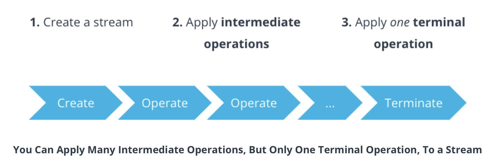

##  Introduction to Functional Programming

Here are some topics covered in this lesson

* Comparing and contrasting imperative and functional programming styles, and understanding when one style might be preferrable over the other.
* Using functional interfaces and lambdas to create shorter, easier-to-read Java code.
* Using the Stream API to process data and aggregate the results into Java collections.

### Imperative Code

Early Java programs were usually programmed in the imperative style. Imperative code usually focuses on ***how a task is performed***. Each line of code gives a specific procedure or operation:

```java
int getTopScore(List<Student> students) {
 int topScore = 0;
 for (Student s : students) {
   if (s == null) continue;
   topScore = Math.max(topScore, s.getScore());
 }
 return topScore;
}
```

* Focuses on how a task is performed.
* Each line of code gives a specific procedure or operation.

### Functional Code

Starting with version 8, Java added language features to support a more functional style of programming. You might also hear some people call it declarative programming.

Functional code focuses on what happens to inputs in order to produce outputs. You can think of it as describing how to get from the input to the output:

```java
int getTopScore(List<Student> students) {
 return students.stream()
     .filter(Objects::nonNull)
     .mapToInt(Student::getScore)
     .max()
     .orElse(0);
}
```

This code does the exact same thing as the last code example, but it uses a more functional programming style, because it:

* Focuses on what happens to inputs in order to produce outputs..
* Describes how to transform the input into the output.

#### Functional vs Imperative Code

* There is nothing wrong with either imperative or functional styles of programming.
*  Anything you can do with one, you can do with the other.
*  Whether to use one or the other often boils down to your specific scenario, and your personal preference as a programmer.

### Using Lambda Expressions

#### Lambda Expressions

***Lambdas*** are a Java language feature that make it very easy to implement certain kinds of interfaces in Java.

#### Code from the Demo

```java
import java.util.List;
import java.util.function.Predicate;

public final class LambdasMain {

    /**
     * Returns the number of strings that match a given condition.
     *
     * @param input the strings that should be tested.
     * @param condition the condition that strings should be tested against.
     * @return the number of strings in the input that match the condition.
     */
    public static long countMatchingStrings(List<String> input, Predicate<String> condition) {
        return input.stream().filter(condition).count();
    }

    public static void main(String[] args) {

        List<String> input = List.of("hello", "\t   ", "world", "", "\t", " ", "goodbye", "  ");

        long numberOfWhitespaceStrings =
                countMatchingStrings(input, s -> s.trim().isEmpty());

        System.out.println(numberOfWhitespaceStrings + " whitespace strings");
    }
}
```

```java
BinaryOperator<Integer> add =
   (Integer a, Integer b) -> { return a + b; };

System.out.println(add.apply(1, 2));
```

### Functional Interfaces

*Only certain kinds of interfaces* can be implemented by lambdas. Those interfaces are called ***functional interfaces***.

A ***functional interface*** is a Java interface with **exactly one abstract method**, called the functional method.

#### Example

```java
@FunctionalInterface
public interface Predicate<T> {
  boolean test(T t);
  default Predicate<T> negate() { return (t) -> !test(t); }

  // Other methods left out of this example
}
```  
The `Predicate` interface from the demo you saw earlier was a functional interface.  
Notice that functional interfaces are Java interfaces, and just like a non-functional Java interface, they are allowed to have type parameters. Here, `Predicate` has one type parameter `T`, which is the type being tested.  
`Predicate`'s one abstract method is `test()`.
`test()` is known as the ***functional method***.
"Abstract" means the method is not implemented, so in order to be a functional method, it cannot have a default implementation.
However, functional interfaces can have other default methods. In this case,
the `Predicate` interface has a default method called `negate()` that returns another `Predicate`.

The `@FunctionalInterface` annotation at the top serves two important purposes:

* If that annotation is added to any interface that is not a valid functional interface, the Java compiler will report a compilation error.
* It tells whoever is reading the code that this is interface is designed to be used with lambdas.

That's why if you intend for an interface to be functional, you should always add the `@FunctionalInterface` annotation.

When you're designing a Java interface, you should consider making it a functional interface if it describes a single operation.

### Exercise: Binary Operations

***Binary operation is a fancy term that refers to a method that takes two arguments.***

#### Defining a Functional Interface

`BinaryOperation.java`

```java
@FunctionalInterface
public interface BinaryOperation {
  int apply(int a, int b);
}
```

`Main.java`

```java
public final class Main {
  public static void main(String[] args) {
    BinaryOperation add = (a, b) -> a + b;
    // Or you could use:
    //
    //  BinaryOperation add = Integer::sum;
    //
    // More on method references later!

    assert 5 == add.apply(2, 3);
  }
}
```

#### Alternative Solution

If you were paying really close attention, you may have noticed you can avoid creating a custom functional interface altogether — just use `java.util.function.BinaryOperator` with a type parameter of `Integer`! Then your `Main.java` method would look like this:

`Main.java`

```java
public final class Main {
  public static void main(String[] args) {
    BinaryOperator<Integer> add = (a, b) -> a + b;
    assert 5 == add.apply(2, 3);
  }
}
```  
[java.util.function](!https://docs.oracle.com/javase/10/docs/api/java/util/function/package-summary.html)

### Anonymous Subclasses

An **anonymous class** is a class that is defined "in-line" and has no name, and so it is called "anonymous".

Nowadays, many anonymous classes can be replaced by lambdas, but there are still some important differences you should know about:

#### Anonymous Class vs. Lambda

This anonymous class...

```java
Predicate<String> anonymousSubclass =
   new Predicate<String>() {
     @Override
     public boolean test(String s) {
       return s.trim().isEmpty();
     }
   };
```

... does the same thing as this lambda expresssion:

```java
Predicate<String> lambdaInstead = s -> s.trim().isEmpty();
```


### What's `this` all about?

Let's take a closer look at that last row in the table. `this` inside an anonymous class refers to the anonymous class, whereas `this` inside a lambda refers to the enclosing class. What does that mean exactly?

Consider this example:

```java
public final class ThisExample {
  private final Runnable withLambda =
      () -> System.out.println("From lambda: " + this.getClass());
  private final Runnable withSubclass = new Runnable() {
    @Override
    public void run() {
      System.out.println("From subclass: " + this.getClass());
    }
  };

  public static void main(String[] args) {
    ThisExample thisExample = new ThisExample();
    thisExample.withLambda.run();
    thisExample.withSubclass.run();
  }
}
```

Here's what it printed on my PC:

```
From lambda: class lesson2.functionalInterface.AnonymousSubclassExample
From subclass: class lesson2.functionalInterface.AnonymousSubclassExample$1
```


Inside the lambda, `this.getClass()` returns the class object representing `AnonymousSubclassExample`.
We'll cover class objects in more detail in the lesson on reflection, but for now the important part is that the
`this` keyword inside the lambda references the enclosing class, which is 
`lesson2.functionalInterface.AnonymousSubclassExample`

For the `Runnable` subclass, on the other hand, the program printed 
`lesson2.functionalInterface.AnonymousSubclassExample$1`

### Limitations of Lambdas

#### Shortcomings of Lambdas

Lambdas are very useful, but they do have some shortcomings:

* They can only be used to implement functional interfaces, not classes.
* Lambdas cannot implement any interface that has multiple abstract methods.
* Lambdas cannot throw checked exceptions (any subclass of Exception, such as IOException).

#### Code from the Demo

You can handle checked exceptions with a `try-catch` inside the lambda:  
```java
import java.io.IOException;
import java.nio.charset.StandardCharsets;
import java.nio.file.Files;
import java.nio.file.Path;
import java.util.Arrays;
import java.util.List;

public final class ReadFilesMain {
  public static void main(String[] args) throws IOException {
    List<String> fileNames = Arrays.asList("file-a.txt", "file-b.txt", "file-c.txt");

    fileNames.stream()
        .map(Path::of)
        .map(p -> {
          try {
            return Files.readAllLines(p, StandardCharsets.UTF_8)
          } catch (IOException e) {
            return List.of();
          }
        })
        .flatMap(List::stream)
        .forEach(System.out::println);
  }
}
```

... or with a `for` loop:

```java
import java.io.IOException;
import java.nio.charset.StandardCharsets;
import java.nio.file.Files;
import java.nio.file.Paths;
import java.util.Arrays;
import java.util.Collection;
import java.util.List;
import java.util.stream.Stream;

public final class ReadFilesMain {
    public static void main(String[] args) throws IOException {
        List<String> fileNames = Arrays.asList("file-a.txt", "file-b.txt", "file-c.txt");

        for (String fileName : fileNames) {
            for (String line : Files.readAllLines(Paths.get(fileName), StandardCharsets.UTF_8)) {
                System.out.println(line);
            }
        }
    }
}
```

### Edge Case: Capturing Variables

Lambdas can *capture* variables from the surrounding code.
If a lambda uses any variables from the surrounding code,
those variables are *captured*.
Variables can only be captured if they are *effectively final*.

An **effectively final** variable is a variable whose value does not change after it is initialized.

#### Example

```java
Map<Year, Integer> getClassSizes(List<Student> students) {
  final Map<Year, Integer> classSizes = new HashMap<>();
  students.stream().forEach(s ->
      classSizes.compute(
          s.getGraduationYear(),
          (k, v) -> (v == null) ? 1 : 1 + v));
  return classSizes;
}
```

A good test to figure out if a variable is effectively final is to add the `final` keyword to it.
If the code still compiles, that variable is effectively final!

In the example, the `classSizes` variable is effectively final
because the value of the variable itself does not change after it's initialized. Remember that in Java, objects are passed by reference. Even though the
`HashMap` changes, the variable's value is the `HashMap`'s location in memory, and that location never changes.


### Method References

In this section, you will learn to identify when to use method references instead of lambdas.

#### What is a Method Reference?

A **method reference** is a short lambda expression that refers to a method that is already named.

If a method with the right parameters and return values is already defined, you can use that instead of writing a new lambda. If this sounds confusing, don't worry — the next code demo should demonstrate how simple method references are to use.

#### When to Use Method References

Generally speaking, if a method is already defined that you can use, you should use a method reference instead of writing a brand new lambda. It's usually a good idea in software development to not write new code if there's already existing code that does the same thing you're trying to do!

Method references cannot capture surrounding variables, though. If you find yourself in this situation, you should use a custom lambda instead.

#### Example

We can take the original lambda expression demo and simplify it using a method reference to 
`String::isBlank`

```java
import java.util.List;
import java.util.function.Predicate;

public final class LambdasMain {

  /**
   * Returns the number of strings that match a given condition.
   *
   * @param input the strings that should be tested.
   * @param condition the condition that strings should be tested against.
   * @return the number of strings in the input that match the condition.
   */
  public static long countMatchingStrings(List<String> input, Predicate<String> condition) {
    return input.stream().filter(condition).count();
  }

  public static void main(String[] args) {

    List<String> input = List.of("hello", "\t   ", "world", "", "\t", " ", "goodbye", "  ");

    long numberOfWhitespaceStrings = countMatchingStrings(input, String::isBlank);

    System.out.println(numberOfWhitespaceStrings + " whitespace strings");
  }
}
```

### The Stream API

#### What is a Stream?

A **stream** is a sequence of elements.

Streams are useful because they allow us to process collection, one element at a time. They can process elements in many ways, such as (but not limited to) filtering or transforming elements, sorting elements, or computing statistics such as the sum or average.

#### Stream Pipelines



A stream pipeline consists of creating a stream, calling intermediate operations on the stream, and then terminating the stream using a terminal operation.

* Streams are *single-use*. Once you do an operation on a `Stream`,
  you cannot to any more operations on that same stream. This means intermediate operations always return a brand new
  `Stream`, never the original.
  
* Streams are *lazily evaluated*. No computation happens until the very end, when the terminal operation is called.

#### Example

```java
void printScores(List<Student> students) {
 return students.stream()
     .filter(Objects::nonNull)
     .mapToInt(Student::getScore)
     .forEach(System.out::println);
}
```

First, the `stream()` method creates a stream from the students list.
This stream pipeline has two intermediate methods:
the `filter()` method removes the elements of the stream that are `null`
, and `mapToInt()` transforms each student into an `int`.
Notice that each of these methods returns another `Stream`:
`filter()` returns a `Stream<Student>`,and `mapToInt()` returns an `IntStream`.

Finally, the terminal operation `max()` computes the maximum value in the `IntStream`.
This terminal method actually returns an `OptionalInt` instead of an `int`.
If the `students` parameter is empty or contains only `null` elements
, it's possible the final stream will be empty. In this case, we need 
to tell the program to return a default value of `0`.

### Stream API: Collectors

#### What is a Collector?

A `Collector` is a terminal stream operation that accumulates stream elements into a container.

#### `Collector` Code Examples

The `collect()` method is a terminal operation that aggregates streams of elements. Collectors can be passed to `collect()` to determine what kind of collection is created.

```java
Set<String> s = stringList.stream().collect(Collectors.toSet());
```

Here, the collector aggregates the elements into a `Set`. There are collectors for all the common data structures such as lists, sets, and maps.

Collectors can be used to perform reduction operations such as adding or counting.

```java
Map<Year, Long> graduatingClassSizes = studentList.stream()
    .collect(Collectors.groupingBy(
        Student::getGraduationYear, Collectors.counting());
```

Here, `groupingBy()` is used to collect elements into a `Map`.
`Collectors.counting()` counts the number of values for each key,
so, in this example, it will count how many students there are for each graduation year.

### Optional Type

#### What is an Optional Type?

* `java.util.Optional` is a container object that may or may not contain a single, non-null value.
*  Optional is an ***alternative*** to using null to represent the absence of a value.

#### Optional Type Example

Optional Types are often returned by terminal operations on streams.

```java
int getTopScore(List<Student> students) {
 return students.stream()
     .filter(Objects::nonNull)
     .mapToInt(Student::getScore)
     .max()
     .orElse(0);
}
```

Here, the `max()` method actually returns an `OptionalInt`,
not an `int`.
If the `students` list is empty, the `max()` method will return an empty optional.

If `max()` returns an `OptionalInt` with a value, that value will be used.
However, if `max()` returns `OptionalInt.empty()`,
the call to `orElse()` makes sure that a default value of `0` will be returned.

This example also shows you how, in addition to `Optional<T>`,
Java also has optional types that are specialized for `int`, `long`, and `double` primitives.
These classes avoid the need for auto-boxing and auto-unboxing of their values.

#### When to Use Optional Types

When you're designing Java APIs, you should consider using `Optional` instead of `null` to represent the absence of values.

`Optional` can have methods invoked on it without throwing `NullPointerException`. The Stream API uses optional types for many of its terminal operations.

However, optionals can sometimes lead to more verbose code by forcing you to call `.get()` whenever you want the value.

