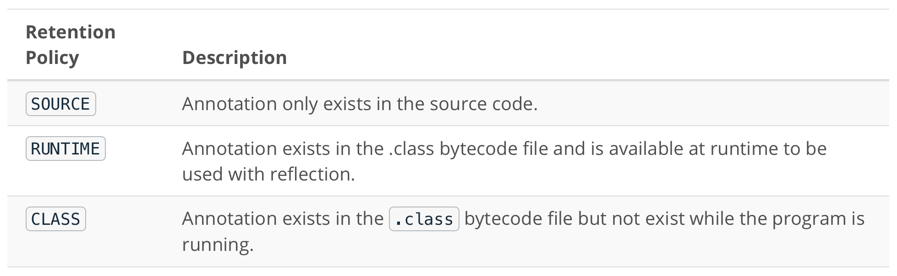
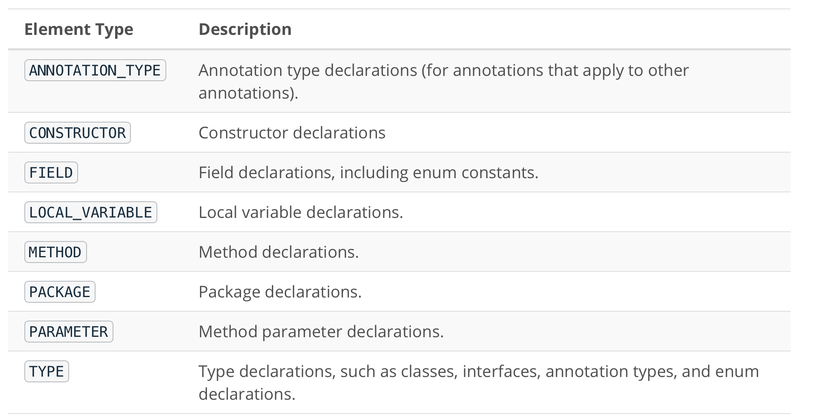
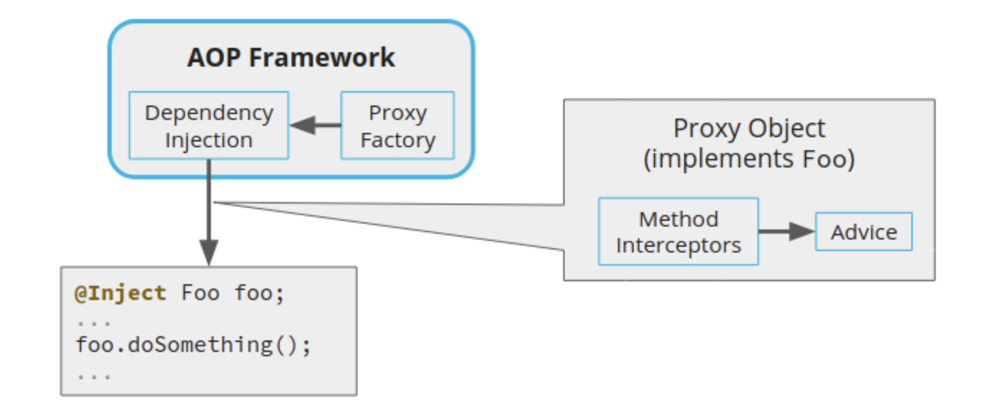

# Reflection

By the end of this lesson, you will be able to:

* Use the Java reflection API to inspect and change the behavior of interfaces, classes, methods, and fields at runtime
* Apply common existing annotations, as well as define your own custom annotations that augment methods and classes with additional functionality at runtime
* Implement interfaces at runtime using dynamic proxy
* Use aspect-oriented programming techniques to satisfy cross-cutting concerns without affecting core code structure.

## What is Reflection?

**Reflection**, which is sometimes called **introspection**, is the ability of a program to examine its own structure at runtime.

Java has a very powerful reflection system that allows the program to see which classes it has loaded, what methods each class declares, what annotations are present, and much more. Java is somewhat special in this regard, because not all languages offer reflection.

### Static vs Dynamic Code

#### Static Code

Normally, when you write a program, all the class names, method names, and variable names are known statically, when the code is being written and compiled:

```java
Foo myObject = new Foo();
```

Static code gives you the benefit of **static analysis**, which includes compile-type checking of static symbols like class and method names, and useful IDE features like auto-completion.

The Java compiler will return an error if you used an invalid class or method name.

#### Dynamic Code

You can also create a `Foo` object without static symbol names. This is sometimes called dynamic coding:

```java
Object myObject = Class.forName("Foo").getConstructor().newInstance();
```

## Annotations

In this section, you will:

* Learn what Java annotations are.
* Practice using common built-in Java annotations.

### What are Annotations?

***Annotations*** are a way to provide extra metadata about your program. Annotations only provide metadata — they have no other effect on execution of the annotated code.

### What Can Annotations Do?

* Annotations can add extra information for the Java compiler, which helps the compiler detect additional errors at compile-time.
* Annotation metadata can be retained at runtime, so that tools can can discover them using reflection and act on use the annotation metadata to make decisions or perform actions.
* Annotations can add compile-time information for code generation tools or other tools that plug into the Java compiler.

### Where Can Annotations Be Used?

You can add annotations almost anywhere in your Java program! You can add them to classes, interfaces, fields, methods, constructors, and even type declarations and type parameters.

#### Common Annotations Demo

##### Code from the Demo

In the demo, the `@Override` annotation helped the Java compiler identify a bug at compile-time that was otherwise pretty tricky to find at runtime.

###### With the Bug

```java
import java.util.HashSet;
import java.util.Objects;
import java.util.Set;

public final class CartItem {
    private final int id;
    private final String name;
    private double cost;

    private CartItem(int id, String name, double cost) {
        this.id = id;
        this.name = Objects.requireNonNull(name);
        this.cost = cost;
    }

    public boolean equals(CartItem other) {
        if (this == other) {
            return true;
        }
        return this.id == other.id && this.name.equals(other.name) && this.cost == other.cost;
    }

    @Override
    public int hashCode() {
        return Objects.hash(id, name, cost);
    }

    public String getName() {
        return name;
    }

    public double getCost() {
        return cost;
    }

    public static void main(String[] args) {
        CartItem book1 = new CartItem(17, "Hitchhiker's Guide to the Galaxy", 7.14);
        CartItem book2 = new CartItem(17, "Hitchhiker's Guide to the Galaxy", 7.14);

        Set<CartItem> items = new HashSet<>();
        items.add(book1);
        items.add(book2);

        System.out.println(items.size());

    }
}
```

###### Without the Bug

```java
import java.util.HashSet;
import java.util.Objects;
import java.util.Set;

public final class CartItem {
    private final int id;
    private final String name;
    private double cost;

    private CartItem(int id, String name, double cost) {
        this.id = id;
        this.name = Objects.requireNonNull(name);
        this.cost = cost;
    }

    @Override
    public boolean equals(Object other) {
        if (this == other) {
            return true;
        }
        if (!(other instanceof CartItem)) {
            return false;
        }
        CartItem o = (CartItem) other;
        return this.id == o.id && this.name.equals(o.name) && this.cost == o.cost;
    }

    @Override
    public int hashCode() {
        return Objects.hash(id, name, cost);
    }

    public String getName() {
        return name;
    }

    public double getCost() {
        return cost;
    }

    public static void main(String[] args) {
        CartItem book1 = new CartItem(17, "Hitchhiker's Guide to the Galaxy", 7.14);
        CartItem book2 = new CartItem(17, "Hitchhiker's Guide to the Galaxy", 7.14);

        Set<CartItem> items = new HashSet<>();
        items.add(book1);
        items.add(book2);

        System.out.println(items.size());

    }
}
```

### Defining Custom Annotations

In addition to the built-in annotations from the previous section, you can also define your own custom Java annotations.

#### Example

```java
@Retention(RetentionPolicy.SOURCE)
@Target(ElementType.TYPE)  // Applies to class, interface, or enum
public @interface ConvertsTo {
  Class<?> targetClass();
  String setterPrefix() default "set";
}
```

#### Elements

Annotations are allowed to have parameterized values, which are called elements. Because annotations are always available at compile-time, the type of an element has to be a compile-time constant, an enum, a class literal, or an array initializer.

Elements can also have `default` values. Element values are set like so:

```java
Object input = ... ;  // Let's pretend we know this is a List<String>
@SuppressWarnings(value = "unchecked")
List<String> result = (List<String>) input;
```

If an annotation only has one element, and the element is named "value", you can skip naming the "value":

```java
Object input = ... ;  // Let's pretend we know this is a List<String>
@SuppressWarnings("unchecked")
List<String> result = (List<String>) input;
```

##### Retention Policies

Here are the possible retention policies for an annotation:



##### Annotation Targets

The target types determine which parts of the program can be given a particular annotation. Here are the possible target types:



## Reflection API

In this lesson, you will learn how to inspect Java programs using the reflection API in the `java.lang.reflect` package.

`Class` objects are the main entry point into Java's `Reflection API`.

Obtaining `Class` Objects

* There are many ways to get Class objects:

```java
Class<String> c = "Hello world!".getClass();
```

* Use .class to create a class literal:

```java
Class<String> c = String.class;
Class<int[]>  c = int[].class;
```

* Create classes dynamically using Class.forName():

```java
Class<String> c = Class.forName("java.lang.String");
```

Once you have a Class object, you can start using reflection with the Class API! Click the link to familiarize yourself with the methods available on classes.

#### Working with Methods

Using the `Class` API, you can also obtain `Method` objects.

`Methods` have some smiliar functionality as `Classes`, such as finding annotations and listing qualifiers, but methods can also be invoked by calling `Method.invoke()`.

You should click the link to familiarize yourself with this API.

### Dynamic Proxy

A ***dynamic proxy*** is a class that implements a list of interfaces specified at runtime.

When you write a class to implement an interface statically, you need to know at compile-time what interfaces you're going to implement

By contrast, if you use a dynamic proxy, you don't need to know at compile-time what interfaces will be implemented. This is all determined at runtime. This is what makes dynamic proxies "dynamic".

#### How Do Dynamic Proxies Work?

* First, you create a custom `InvocationHandler`. `InvocationHandler` is an abstract class that receives `method` invocations. A method invocation is a Method and an array of parameters.
* Then, you create a dynamic proxy instance using the `Proxy.newProxyInstance()`.
* When clients call a method on the proxy instance, the method invocation is forwared to your `MethodInvocationHandler`.

##### Code from the Demo

```java
import java.lang.reflect.InvocationHandler;
import java.lang.reflect.Method;
import java.lang.reflect.Proxy;
import java.util.HashSet;
import java.util.Set;

public final class LoggingProxy {
    public static void main(String[] args) {

        Set<String> targetSet = new HashSet<>();

        Object proxy = Proxy.newProxyInstance(
                LoggingProxy.class.getClassLoader(),
                new Class[]{Set.class},
                new LoggingInvocationHandler(targetSet));

        Set<String> loggedSet = (Set<String>) proxy;
        loggedSet.add("item");

        System.out.println(targetSet.contains("item"));
    }

    static class LoggingInvocationHandler implements InvocationHandler {

        private final Object targetObject;

        public LoggingInvocationHandler(Object targetObject) {
            this.targetObject = targetObject;
        }

        @Override
        public Object invoke(Object proxy, Method method, Object[] args) throws Throwable {
            System.out.println(targetObject.getClass() + "." + method.getName() + "()");
            return method.invoke(targetObject, args);
        }
    }
}
```

### Aspect Oriented Programming (AOP)

Aspect Oriented Programming (AOP) is a design pattern that organizes code into cross-cutting concerns.

* A ***cross-cutting concern*** is any concern that affects many different parts of the system. Examples include: logging, performance profiling, and database transaction managements.
* All the code that handles a ***cross-cutting concern*** is organized into an ***aspect***, which is subdivided into ***advice***.
* ***Advice*** plugs into your executing code, via a method interceptor, to take care of the cross-cutting concern.
* ***Join points*** are places where advice can plug into your code, usually via method interceptors.
* Whereas a join point is a place where your code could potentially use advice, ***pointcuts*** are places where your code actually does use advice. An aspect is defined by advice and one or more pointcuts.

### How AOP Uses Dynamic Proxies and Dependency Injection



* AOP uses dynamic proxies to intercept methods and execute advice.
* When you add an @Inject annotation to your code, the AOP framework uses dependency injection to supply an object. The supplied object is actually a dynamic proxy with method interceptors to run different pieces of advice code.

### How Java Loads Classes

Before we get into the details of class loaders, let's brush up on these terms by reviewing the basic lifecycle of developing and executing a Java program.


##### Basic Lifecycle

* You start by writing Java source code, which is human-readable text.
* The Java compiler, or the javac command, compiles the source code into bytecode. Bytecode is Java's platform-independent representation of the classes in the program.
* The Java launcher, or the java command, starts up the Java Virtual Machine, and loads the bytecode to execute the program.

#### Where Java Looks for Bytecode

Class bytecode is stored in files, such as `.class` files, `.jar` files, or `.zip` files. The Java launcher needs to find these files. Here are the different ways the Java launcher looks for them:

* Looks in the lhe local file system for the Java Runtime Installation, which contains Bootstrap Classes, like `java.lang.Object` and `java.lang.String`. The location of the installation comes from the JAVA_HOME environment variable.
* Looks for user-defined classes in the current directory where the `java` command is running.
* Follows the `CLASSPATH` environment variable.
* Follows the `-classpath` or `-jar` options passed to the `java` command on the command-line.

### Class Loaders

Every class in the Java Runtime is loaded by a `ClassLoader`.

The input to a `ClassLoader` is the name of the class to be loaded, and the output is the `Class` object representing that class:

The `ClassLoader` tries to locate the bytecode of the class (similarly to how the Java launcher loads bytecode — described above), and then creates an instance of the corresponding `Class` object.


***Custom ClassLoader***

```java
import java.lang.reflect.Method;
import java.net.URL;
import java.net.URLClassLoader;
import java.nio.file.Path;
import java.util.ArrayList;
import java.util.List;

public final class TestRunner {

  public static void main(String[] args) throws Exception {
    if (args.length != 2) {
      System.out.println("Usage: TestRunner [test folder] [test name]");
      return;
    }
    List<String> passed = new ArrayList<>();
    List<String> failed = new ArrayList<>();
    Class<?> testClass = getTestClass(args[0], args[1]);
    for (Method method : testClass.getDeclaredMethods()) {
      if (method.getAnnotation(Test.class) == null) {
        continue;
      }
      try {
        UnitTest test = (UnitTest) testClass.getConstructor().newInstance();
        test.beforeEachTest();
        method.invoke(test);
        test.afterEachTest();
        passed.add(getTestName(testClass, method));
      } catch (Throwable throwable) {
        failed.add(getTestName(testClass, method));
      }
    }

    System.out.println("Passed tests: " + passed);
    System.out.println("FAILED tests: " + failed);
  }

  private static Class<?> getTestClass(String testFolder, String className) throws Exception {
    URL testDir = Path.of(testFolder).toUri().toURL();
    URLClassLoader loader = new URLClassLoader(new URL[]{testDir});
    Class<?> klass = Class.forName(className, true, loader);
    if (!UnitTest.class.isAssignableFrom(klass)) {
      throw new IllegalArgumentException("Class " + klass.toString() + " must implement UnitTest");
    }
    return klass;
  }

  private static String getTestName(Class<?> klass, Method method) {
    return klass.getName() + "#" + method.getName();
  }
}
```