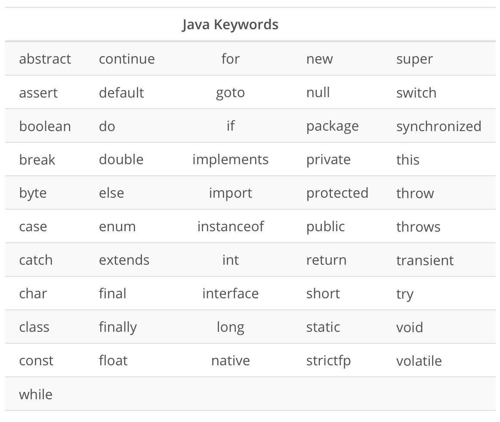
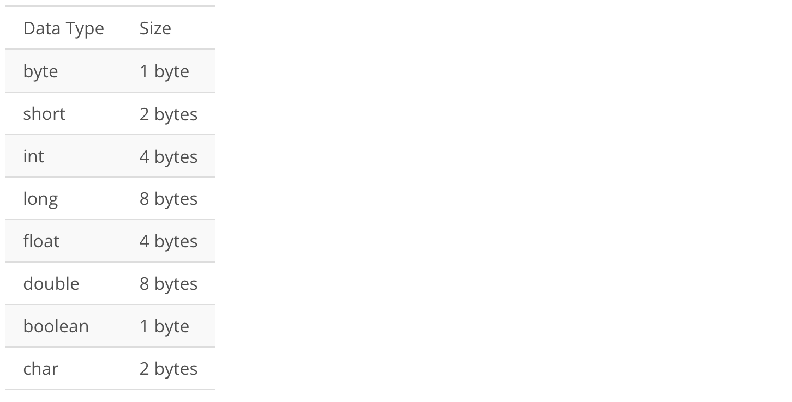
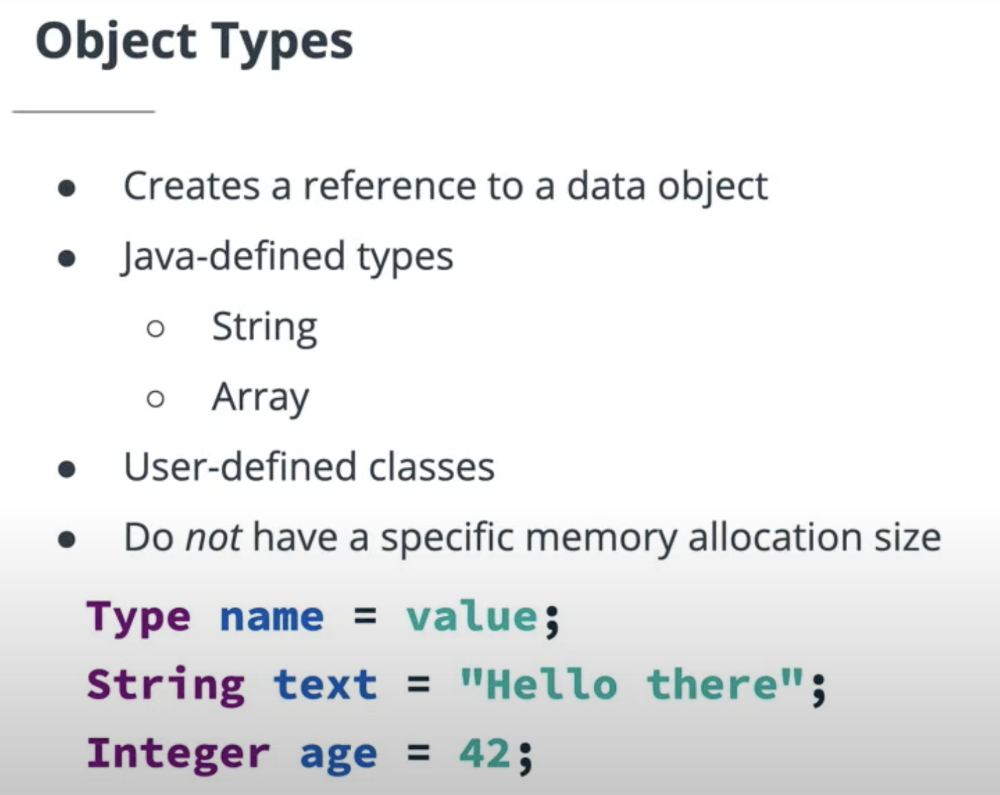

# Lesson Overview

This lesson covers all the major building blocks we need to create a simple Java app:

* Keywords. If we want to build an application in Java, we first must understand the basic vocabulary of the language. Java's keywords will provide us with that core, predefined words of the Java language.
* Variables. Variables will provide us with a way to store data for our application. We'll learn how to use variables in Java and then we'll consider some key ways in which Java variables differ from those of other languages (such as Python).
* Loops. Loops allow us to iterate over data structures, executing the same code repeatedly until a condition is met, making it possible to process large data structures with only a few lines of code.
* Methods. The central idea behind methods is that we want to write a block of code once that we can then re-use many times.
* Access Modifiers. We will learn how to use access modifiers to restrict access to variables and methods, so that users of our applications cannot access all of the data directly and in an unsafe manner.
* Javadoc. How do we know how to communicate with an existing Java application? Or, once we create our own application, how do we share it with others? JavaDoc produces a searchable HTML document that defines the classes and interfaces of an application, making it easy for you or any developer to understand how to use the code.
* Arrays. Arrays will provide us with a way to easily and efficiently store and retrieve collections of data, such as a list of phone numbers.

## Java Keywords

If we want to build an application in Java, we first need to know the basic vocabulary of the language. This vocabulary is made up of what we call keywords.

**Keywords are simply words that have a predefined meaning in the Java language.**

Java has 51 keywords, as shown in the table below.

But the key thing to remember is that these words already have a meaning in Java, so they are reserved. That means you cannot use them when you are naming your own variables, methods or classes.

## Variables

***Variables*** are used to store data for our application. A variable is a combination of:

* A location in the computer's memory and
* An associated name that we can use in our code to refer to the data in that memory location

Specifically, variables help us store state data.

***State data is data related to the current state of the program as it is running.***

### Using Variables in Java

To **declare** or **define** a variable in Java, we specify the data type, the name of the variable, and any value we want to store in the variable. For example, here we declare an integer value with the name age that holds the value 42:

int age = 42;

Now when we type the word age in our code, it will refer to this location in memory.

The reason we use the term "variable" is because it is able to vary. After we have declared it, we can easily change the value of the variable as many times as we like:

int age = 42;  
age = 43;  
age = 44;  

These lines are referred to as assignment statements(because we are assigning the value on the right to the variable named on the left) and the = sign is called the assignment operator.

## Static vs Dynamic Typing

Notice that, in Java, we must specify the data type (e.g., int). This is becouse Java is a statically typed language. Here are the key points to remember about ***static typing***:

* The data type is bound to the variable when the variable is first declared.
* The data type is checked when the code is compiled.
* The data type for a variable cannot later be changed.

In contrast, some languages are dynamically typed. In dynamic ***typing***:

* The data type is bound to the value itself, but not to the variable.
* The type is checked during runtime.
* The data type of a variable can be changed after it is declared; since the type is associated with the value, assigning a new value may mean changing the data type.

Python is a popular example of a dynamically typed language. For example, in Python, you can declare a variable without explicitly stating the type:

age = 42

And you can later assign a value of a different type to that variable:

age = "forty-two"

And this will work—it will not throw a type error (as it would in Java), because the type is associated with the value, rather than being associated with the variable.

However, this could cause other problems or unintended behavior in the application. Perhaps the application later makes a calculation based on the user's age, and now that the age is stored as a string, that calculation will fail. Thus, dynamic typing, while it has its advantages, can lead to errors or unexpected behavior.

In contrast, one of the nice things about Java being statically typed is that you declare the data type of the variable before the code even runs, and you can be sure that no matter what new values the variable takes on, it will always be the same type of data.

## The Semicolon ; Ends a Line

Notice that Java ends every statement with a semicolon, ;. This is how Java knows it has reached the end of the statement. If we leave the semicolon off the ends of these lines:

int age = 42  
age = 43

Then Java will read them as a single line:

int age = 42age = 43

And this would cause an error.

## Primitives vs Objects

### ***Primitive Values vs Reference Values***

In Java, there are two general kinds of values we can assign to a variable:

* A *primitive value* is simply a value, by itself, with no additional data.
* A *reference value* is a value that refers to an object stored in another location in memory.

Objects bundle the primitive value up with additional useful information and behavior. We'll get into how to create and use objects more later on.

### Primitive Types

In Java, there are eight primitive types, as you can see here:

As you can see in the table, each primitive type has a memory size allocation, meaning that if we created a variable with one of these types, that variable would have a certain size in memory (e.g., an int primitive is always allocated 4 bytes in memory).

The syntax for defining a primitive variable is simply an assignment statement like our example from earlier:

int age = 42;

Here, the integer 42 is a primitive value.

To declare a variable for the long primitive, we would simply type something like:

long agePlantEarth = 4005000000;

Notice that all of the keywords for primitives start with a lowercase letter.

### Object Reference Types

As we said above, reference types create a reference to a data object. This object can be a Java defined type, like String or Array or it can be a customized, user-defined object. This allows literally infinite flexibility, since you can define whatever object types you need for your particular application.

Unlike primitive types, object types do not have a specific memory allocation size. The reference to the object can be of a known, fixed size, but the object itself may vary greatly in size (e.g., the string "hi" will be allocated less space than the string "abcdefghijklmnopqrstuvwxyz").

The syntax for declaring a String object variable looks like this:

*String text = “Hello there”;*

Or if we want to create an object variable for an integer, that looks like this:

*Integer age = 42;*

Notice that the keywords for creating object variables begin with an uppercase letter (String and Integer) rather than the lowercase used for primitives (e.g. int and long).

Again, one of the benefits of creating an object is that it can include additional data and behavior. For example, String objects are bundled with a method called length that lets us get the length of the string. For example:

String text = “Hello there”;  
text.length();

This second line would give us the length of the string "Hello there", which is 11 characters long.

## Type Casting

Type casting is changing one type into another type. There are two kinds of type casting: Automatic and manual.

### Automatic Type Casting  

Automatic type casting converts a smaller type into a larger type. For example:  

int intNumber = 3;  
double doubleNumber = intNumber;  
System.out.println(doubleNumber);  

When we print doubleNumber, the value will be 3.0. Notice that there is no precision lost going from a smaller type into a larger type. We started with 3 and ended up with 3.0.

### Manual Type Casting

Manual type casting is necessary when we want to do either of these things:

* Convert a larger type into a smaller type
* Convert one object type into another

For example, here we are converting from a larger type (double) to a smaller type (int):

double doubleNumber = 3.5;  
int intNumber = (int)doubleNumber;  
System.out.println(intNumber);  

The resulting value will be 3, not 3.5. When we go from a larger type into a smaller type, precision is lost. Java cuts off additional data that will not fit in the casted type. So when we go from a double to an int, any values that are not integers will be removed. This is called truncation.

## Truncation

Truncation is a loss of precision when going from one to type to another. Basically, we are cutting off or "truncating" the additional data.

Note that this is not the same thing as rounding. For example, if we round 3.9, we get 4.0. But if we truncate 3.9, we get simply 3! Truncation simply removes the additional data that will not fit, which is why it results in a loss of precision.

## Methods

Sometimes we have a block of code that we would like to re-use.

### Method Syntax

Methods have four parts:  
* ***Name***. The name of the method, which we use when calling or invoking the method.
*  ***Parameters***. The variables that we pass the values to when we call the method.
* ***Method body***. The chunk of code, contained within curly braces, { }, that gets run when the method is invoked.
* ***Return type***. The data type of the value that the method returns.

### Methods vs Functions

* A function is any block of reusable/callable code. *
* A method is a block of reusable/callable code that is attached to a class or object.

So a method is a type of function, but it's one that is associated with a class or object, whereas other functions can be executed from anywhere.

In other words, we call any block of reusable code a function, whereas only some functions are also methods. All methods are functions but not all functions are methods.

